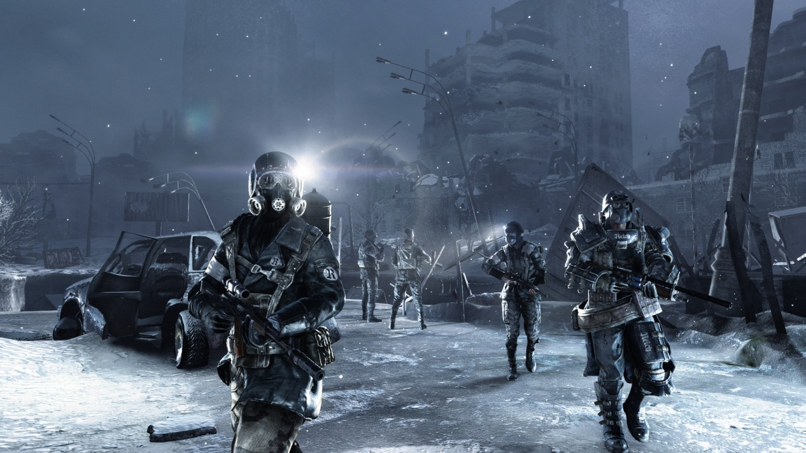

# 2.1. 포스트 뮤지엄 아포칼립스

아도르노는 그의 책 &lt;발레리 푸르스트 박물관&gt;에서 19세기 말경 근대의 박물관이 시작될 무렵에 대한 주요 담론을 다루고 있다. ‘예술작품의 공동묘지’라고 말했던 발레리에 따르면 박물관은 과거의 예술을 죽이고 문화를 중성화하는 곳이었고, ‘예술작품이 이상화되는 장소’라고 말했던 프루스트에 의하면 박물관은 모든 장식적인 요소를 제거하고, 작품 본연의 가치와 진리를 시험하는 곳이었다. 다소 논쟁적일 수 있는 두 담론은 예술 작품의 ‘사물화’라는 전제로부터 출발하며, 이러한 사물은 1851년 영국 런던 수정궁에서 만국박람회에서 처음 등장하였다. 당시 박람회는 인간 이성에 대한 낙관적인 희망과 근대 기술과 과학으로 점철된 유토피아적 환상, 그리고 이념·역사·민족·국가 간의 긴장과 ‘자본-노동’ 계급 간의 갈등이 한데 뒤섞인 가운데, ‘세계’라는 시공간을 압축하여 추상적으로 보여주는 공간이었다. 바로 이러한 공간에서 식민지에서 수집 온갖 노획품 두 가지의 사물로 재탄생한다. 계급 간의 갈등을 봉합하는 소비재이거나 내면의 삶과 행동규범을 바꾸는 문화재로. 이는 오늘날 박물관과 백화점에서 그 명맥을 유지하고 있었다. 하지만 최근 코로나바이러스 펜데믹 기간 동안 대중들을 위한 이러한 대형 실내 공간은 모두 문을 닫게 되었다. 

국내 대부분의 박물관은 지난 1월부터 시작된 신종 코로나바이러스 감염증의 확산으로 인해 장기간 휴관할 수밖에 없었고, 이제는 마치 특별한 이벤트처럼 한시적으로 박물관을 운영하는 것이 익숙한 일이 되어버렸다. 그리고 대부분의 사람들은 마치 비디오 감시카메라와 같은 폐쇄회로망 속에 갇힌 듯이 극도로 제한되고 통제된 방식의 생활을 영위해 가고 있다. 한편 코로나바이러스의 확산과 더불어 트위터에서는 ‘동물의 숲’이라는 게임 검색어가 폭발적으로 증가하기 시작하였는데, 외딴 섬에서 홀로 모든 것을 새롭게 시작해야 되는 것과 ‘끝이 없다’라는 게임의 설정은 어딘지 모르게 이 낯선 현실과 유사하였다. 굳이 다른 점이 있다면 게임에서는 네트워크로서의 커뮤니티를 지향한다는 점이다.

이러한 배경을 바탕으로 박물관에서는 지난 6월부터 일군의 현대미술 기획자, 큐레이터, 작가, 디자이너, 건축가 등과 협업하여 디지털 뮤지엄 건립 사업을 추진하였다.현재 상황에 대한 박물관의 문제의식은 코로나 바이러스로 인한 위기 상황을 극복하는 것을 넘어서 ‘온택트 시대에 디지털 정보가 세상의 의미를 코드화 하는 문화적 관습을 어떻게 바라볼 것인가?’하는 것이었다. 한편 박물관의 목표가 ‘어린이와 함께 성장하는 박물관’이 되는 것인 만큼 디지털 네이티브\(Digital Native\) 세대의 대표적인 놀이문화라고 볼 수 있는 게임에 대한 문화적 의미를 설명하는 것은 그 동안 박물관의 학예사들이 고심하고 있었던 하나의 중요한 주제였다.

기존 VR, AR 등의 최첨단 미디어 기술이 현실을 모방한 스펙타클한 가상세계를 구현하는데 초점이 맞추어져 있었다면 이번에 박물관에서 추진한 디지털 뮤지엄은 가상세계 그 자체의 현실을 보여주기 위해 노력했다는 점에서 차이를 보인다. 게임을 비롯하여 디지털에 기반을 둔 문화적 현상을 이해하는 것, 디지털로 만들어진 가상세계에 대한 ‘문해력’을 키우는 것이 이번 사업의 핵심적인 목표이다.

