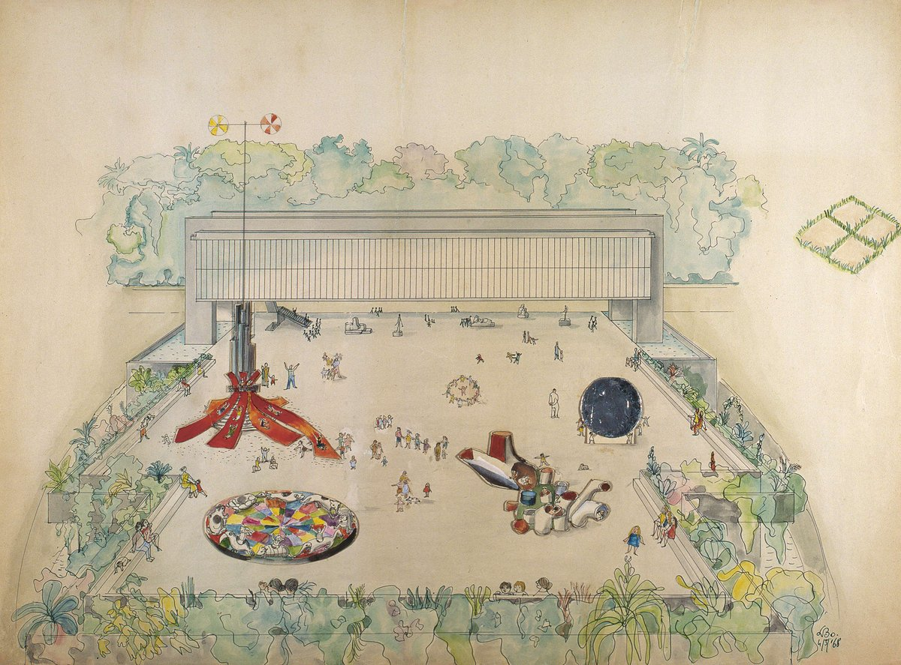
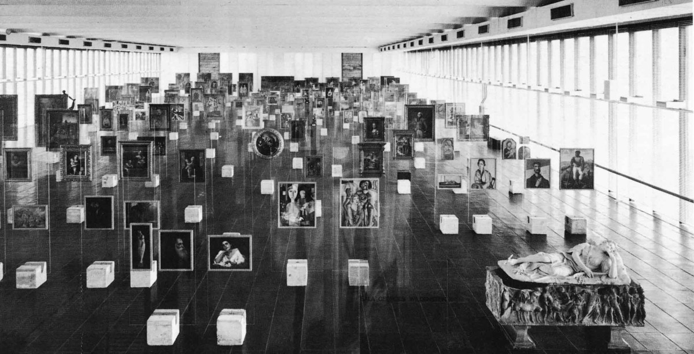

# 2.2. 혁신이라는 전통

게임 속에 지어진 박물관을 보게 된다면, 분명히 그 첫인상은 유치하거나 장난스럽거나, 어쩌면 박물관에 대한 반달리즘으로 비춰질 수도 있다. 하지만, 역사라는 시간과 물리적 영토에서 벗어난 이 박물관은 전통적인 박물관 제도에서 벗어나 이 사회의 ‘혁신’이라는 전통에서부터 출발하고자 하였다. 그러한 사례로서 우리가 참고한 것은 이탈리아 건축가 리나 보 바르디\(Lina bo Bardi, 1914-1992\)가 설계한 브라질의 상파울루 미술관\(Museu de arte de São Paulo, 1968 -\)과 최근 동물의 숲에서 일어난 홍콩의 민주화 운동이었다.

상파울루 뮤지엄은 평소 주말마다 1층 벼룩시장에 모여드는 사람들로 인해 광장이 되고 정치적으로 큰 사건이 있을 때면 대규모 집회나 데모 등이 열리는 곳이기도 하며, 이는 브라질에서 가장 인구가 많은 도시인 상파울루의 가장 비싼 거리에서 유일하게 사람들이 모일 수 있는 장소이기도 하다. 한편 당시 지어진 대부분의 미술관\(박물관\)이 고전주의 건축 양식을 택한 것과 달리 상파울루 미술관은 브라질 전통 가옥의 창에서 흔히 볼 수 있는 묵사라비\(muxarabi\) 양식에서 착안한 듯 마치 거대한 유리 상자처럼 모든 빛이 투과하는 개방된 공간으로 지어졌으며, 개관 당시 모든 작품은 유리 이젤\(Glass esel\)에 걸쳐진 채 자연광이 환한 전시장 내에 쏟아지는 나열되어 있었다. 이에 대해 바르디는 다음과 같이 말하였다.

> 이 새로운 환경에서 그림과 대중은 해방되고 자유롭다; 그림을 보는 것은 댄스 파트너를 선택하는 문제가 된다; 이와 같은 방식으로 예술 작품에 접근하는 것은 한 쪽이 우위에 서는 것이 아닌 동등한 관계의 만남이다.

이처럼 상파울루 미술관은 미술사나 작품이 아닌 대중을 위한 곳이었으며 사회의 필요를 위해 그 공간을 내어주는데 주저함이 없었다. 과거 이와 같은 대등한 관계를 지향하는 커뮤니티는 낯설고도 꽤나 혁명적인 문제였지만, 오늘날 게임이나 SNS, 웹과 같은 초 연결 사회\(hypoer-connected society\)에서는 보편적인 일상이 되어가고 있다. 게임 연구가에 따르면 “현재의 게임은 그 자체가 하나의 사회이자 공동체로서 움직이며 철저히 상호작용을 전제로 대등한 관계를 지향한다”고 한다. 현재 홍콩 민주화 운동의 새로운 거점으로 떠오른 ‘동물의 숲’은 바로 그러한 함의의 대표적인 사례라고 볼 수 있는데 과거 이러한 종류의 혁명은 리처드 스톨먼이나 리누스 토발즈, 미겔 데 이사카와 같은 진짜 혁명가만이 할 수 있었다. 하지만 최근 동물의 숲에서 벌어진 혁명을 통해 우리가 좀더 고민해보고자 하는 것은 ‘굳이 혁명을 위해 우리 모두가 뛰어난 혁명가가 될 필요가 있는가?’하는 것이다.

동물의 숲에서 조슈아 웡이 ‘광복 홍콩, 시대 혁명’이라는 시위 캐츠프레이즈를 내건 행위는 명백한 사실이지만, 어쩌면 중국 정부를 긴장시킬 정도로 위협한 것은 그러한 정보를 신속하게 전달하는 개인의 트위터와 인스타그램, 페이스북, 그리고 유투브와 각종 디지털 언론 매체였는지도 모른다. 즉 지금과 같은 네트워크로서의 커뮤니티에서 ‘공유’가 지니는 혁명적 기질은 혁명가가 아닌 디지털 매체에 의해서 완수되었다고 볼 수 있다. 마샬 멕루한이 말한 것처럼 ‘매체’ 그 자체가 ‘메시지’였던 셈이다.

