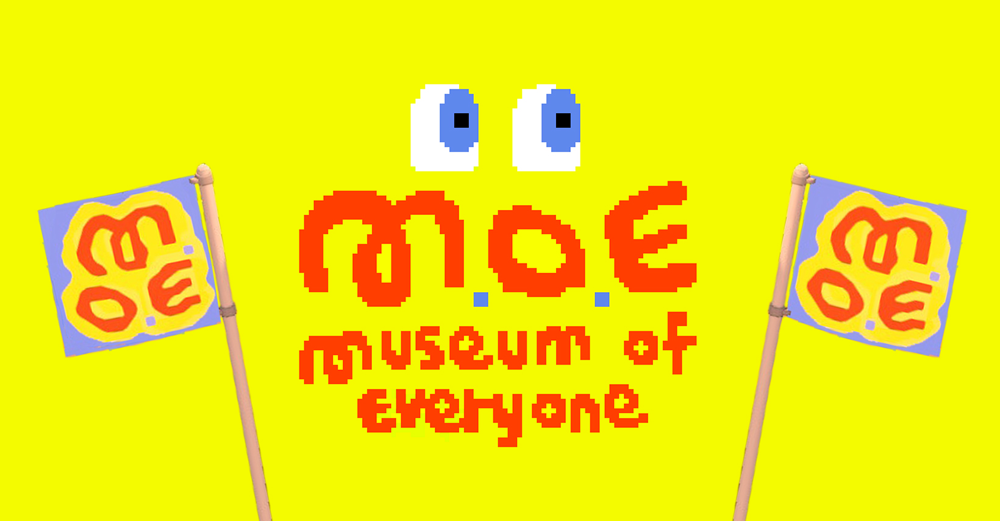
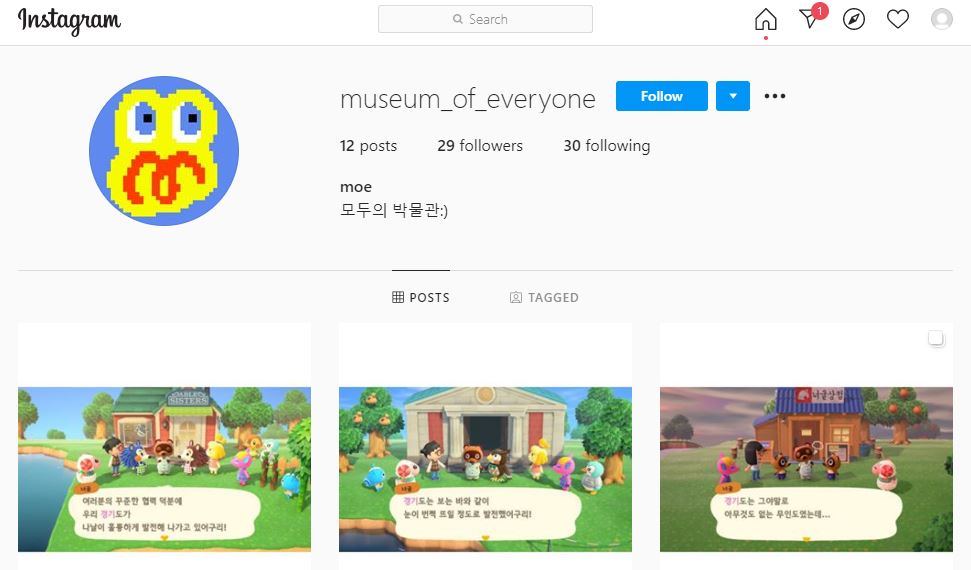

# 2.3. 은유로서의 퍼블릭 도메인

이 디지털 뮤지엄이 지향하는 바는 다음과 같다.

1. 보다 근본적인 차원에 박물관은 언제나, 누구에게나, 어디서든 접근 가능한 퍼블릭 도메인이어야 하며
2. 미술작품 이면의 의미구조는 미술사가 아닌 현실의 사회적 구조에 의해 암시될 수 있어야 하며 
3. 박물관은 소장품이 이상화되거나 대중을 교화하기 위한 장소가 아니라 다양한 문화적 담론이 형성되는 공론장이 되어야 한다.

그런 의미에서 박물관의 이름은  '모두의 박물관\(Museum of Everyone, 이하 MoE\)'이라고 짓기로 하였다. MoE는 큐레이터 홍이지를 비롯하여 건축가 이세영, 디자이너 봉완선, 그리고 시각예술 작가 김정태, 선우훈을 중심으로 구성된 위원회를 통해 건립을 추진하였다. 박물관의 소속 구성원이 아닌 특수관계인에 위치한 사람들이 박물관의 의사결정에 적극적으로 개입하고 박물관의 담론을 생산하는데 능동적으로 참여하는 것은 MoE가 ‘모두’의 박물관이 되기 위한 첫 번째 조건이었다.

전시에 선보일 모든 작품은 디지털 오브젝트로 제작할 예정이며, 전시가 끝난 뒤 작품 보존을 위해 MoE에 소장할 계획은 있으나 이를 어떠한 형태의 물리적인 저장장치로도 소유할 계획은 없다. 한편 참여 작가와 개별 협의를 통해 일부 작품은 추후 오픈소스로 배포할 계획이다. 하지만 여기서 말하는 ‘오픈소스’란 예술작품을 어떠한 비용 지불 없이 인터넷처럼 사용할 수 있다거나 공공선을 위해 예술가 개인의 권리쯤은 희생할 수 있다는 것을 뜻하는 것은 아니다.

작품의 물리적 실체가 없다는 점에서, 박물관이라고 해서 그것을 소유할 수 없다는 점에서 이는 기존 박물관의 소장품과는 현격한 개념적 차이가 있다. 그러한 문제는 차치하고서라도, 작품과 같은 지적 재산을 지적 공유재로 사용한다는 것은 언뜻 보기에도 상식 밖의 행위로 비춰질 수 있다. 하지만 이는 지식이나 정보가 인터넷과 같은 네트워크 환경에서 가치를 획득하는 과정에서 자연스러운 비롯되는 현상으로서, 지금과 같은 디지털 시대에 오픈소스의 사용은 세분화된 분업을 통해 소프트웨어를 생산하는 보편적인 노동 방식으로 안착되었다.

오픈소스는 ‘공유’라는 행위를 통해 그 실체 드러내는데, 애초에 오픈소스란 지식을 일부 계층이 독점하여 이를 권력화 하는데 반대하는 것에서부터 출발하였다. 과거 박물관의 사물들이 특권층과 지배층의 통치이념을 사회적 체계·질서·제도로 관습화하기 위한 수단이었다면, 현재 MoE에서 벌어지고 있는 일련의 과정은 지금과 같은 초 연결 사회에서는 작품을 전시하고 관람하고 소유하는 전통적인 사고방식에 대한 변화가 필요함을 역설하는 것이다.

MoE의 이러한 활동은 게임 내에서 뿐만 아니라 인스타그램\(@museum\_of\_everyone\)을 통해서도 활발히 이어나갈 예정이다. 매체가 발달한 디지털 사회로 진입하면서 인간의 소통은 미디어의 개입에 의해 광범위하게 영향을 받고 있는데, 오늘날 ‘동물의 숲’이 세계적으로 폭발적인 인기를 누리게 된 것 또한 트위터나 유투브와 같은 매체에 힘입은 바가 크다. 오늘날 온라인 매체에서 흔히 볼 수 있는 크리에이터나 스트리머는 매스미디어나 대중의 편향성에서 벗어나 다양한 온라인 매체와 커뮤니티를 통해 정보의 생산자로서 혹은 콘텐츠의 창작자로서 다양한 소수문화, 개인성에 기반을 둔 마니아 문화를 형성한다. 따라서 MoE는 여러 층위의 관람객 사이에서 다양한 담론이 형성될 수 있도록 지속적으로 혁신적인 사고와 논쟁적인 주제의 대화를 위한 담론의 언어를 제공할 예정이다.

