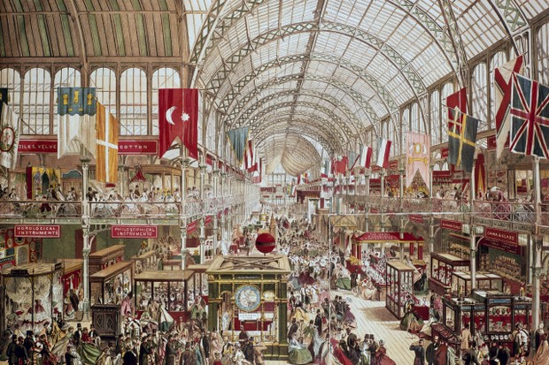

# 2. 스테이트먼트

> 미술관은 공짜인 데다 세련된 사람들도 많아서 눈요기 삼아 가기 딱 좋으며 미술관에 가면 갤러리아 명품관이나 호텔 로비에 들어온 것 같은 기분이 들었다. 미술관은 신기술 박람회였으며 에어컨이 나오는 산책로이다.   
> - _정지돈, &lt;예술가의 스테이트먼트&gt;\(2016\)_

사람들은 박물관에 있는 역사적으로 의미 있는 사물을 통해 지식을 학습하기도 하며, 그 사물을 통해 종종 그리스 시대의 풍경을 떠올려 보기도 한다. 박물관은 삶의 기억을 담고 있는 역사적인 결과물로서 시간과 사건의 기록이자 기억의 저장소이다. 그래서 ‘박물관’이란 인류가 삶으로서 겪은 많은 중요한 것들이 오랜 시간에 걸쳐 정제된 형태로 제시된 지적 언어이기도 하다. 문법체계에 의해 소리가 의사소통을 위한 언어로 교환되듯이, 지금껏 한 번도 반복된 적이 없는 연속적인 사건은 박물관에 의해 역사적인 텍스트가 되었다. 그리스 시대의 신전으로 분한 박물관의 모습은 마치 그 자체가 역사라는 거대한 시계열에 대한 표상과도 같다. 과거와 현재를 동일한 하나의 현상으로 묶어 동일성을 확보하려 했던 이러한 시도는 인류의 모든 행위와 다양한 삶의 방식에는 그 기저를 이루는 보편적인 진리가 있다는 믿음을 바탕으로 한다. 그리스 시대뿐만 아니라, 신화와 제의, 금기, 야만과 식인종에 이르기까지. 

그래서 삶은 마치 뜬소문과 같다.

근대 초기의 역사가 중세와의 단절을 위해 잊힌 그리스의 역사로부터 시작하듯, 역사란 어쩌면 박물관이 오랜 시간 동안 사물들과 관계를 맺으며 발전시켜온 자의적인 관계일지도 모른다. 그런 점에서 역사란 각 시대별로 고유한 경험이나 인식의 범위 안에서 '어떤' 성질이나 질서에 따라 기술되는 경향이 있다. 양차 세계 대전을 겪으며 인간 이성에 대한 희망은 본성에 대한 비관으로 방향 전환을 모색했다. 사람들은 인간의 보편적인 의식이나 절대적인 진리가 현실 속에서 만들어내는 다양한 차이에 대해, 구조와 질서 대신에 ‘이질감’과 ‘우연’, ‘도저히 설명할 수 없음’을 만들어내는 다양한 힘들과 움직임에 대해 고민하기 시작했다. 16세기 계몽주의로부터 시작하여 초월적 지위를 부여 받은 인간은 19세기 근대의 정점에서 박물관을 맞이한다. 

박물관의 원형으로 알려진 만국박람회는 1851년 런던에서 시작하여 국제적인 유행으로 번졌으며, 박람회장은 근대 사회의 거의 모든 요소들이 복합적으로 상호작용하는 공간이었다. 보편적인 인간 주권 의식의 성장과 더불어 시장경제의 번영과 공공영역\(public realm\)의 구조변동에 의해 물신이 지배하는 박람회장은 만국의 노동자를 위한 순례지인 동시에 노동자와 자본가를 위한 해우소였다. 한편, 문명과 야만으로 교묘하게 포장된 문화는 과거 종교가 그러했듯이 특권층과 지배층의 통치이념에 따라 사용되었다. 각국으로부터 수집한 사물들에 의해 정교하게 왜곡된 근대의 시공간 속에서 사람들은 식민 지배를 당연하게 생각하였다. 그렇다고 해서 박물관의 역사는 저주를 받았다고 비난하거나 이제 와서 박물관은 우리 모두가 원치 않았던 사생아였다고 할 수는 없는 노릇이다. 그러기에 박물관은 누구나 자유롭게 이용할 수 있는 일상적인 장소가 되었으니까. 

오늘날 박물관은 청산해야할 근대의 잔여물로 인식되는 한편, '박물관'이라는 제도의 문화적 헤게모니론은 다양한 저항이론의 비판의 대상이 되기도 한다. 그러거나 말거나 여전히 박물관은 ‘어떻게 사회적 조화에 기여할 수 있는가?’라는 스스로가 부여한 임무에서 헤어나오지 못하고 있다.

지금, 박물관은 스스로의 무덤을 파고 있는 중이다. 

