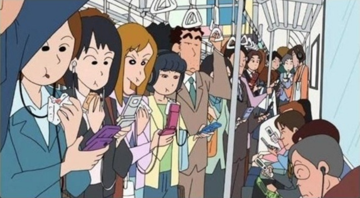

# 4.1. 전염병 시대에 미술관에 간다는 것


  
2019년 월드 와이드 웹\(World Wide Web\)의 30주년을 맞이하여, 우리는 새로운 미래가 도래할 2020년에 대한 기대감으로 가득 찼었다. 4세대 이동통신인 LTE\(Long Term Evolution\)가 등장한 지 10년 만에 5세대 이동통신의 상용화가 이루어졌으며 인공지능, 사물 인터넷, 클라우드 컴퓨팅, 빅데이터, 지능 정보기술, 나노기술에 이르기까지 인류의 엄청난 과학기술 발전의 성과를 눈앞에 두고 있는 듯했다. 그뿐만 아니라 2019년은 세계여행 자유화가 시작된 지 30년이 된 해이기도 했다. 민간 우주여행의 가능성을 타진하며 새로운 시대로의 진입을 꿈꿨던 우리는 결국 전염병으로 인해 국경이 봉쇄되고 이동이 제한되는 초유의 사태를 경험하고 있다.

코로나19 이전까지 온라인 환경은 가상, 대체, 확장, 대안 공간으로 인식되었다. 그러나 코로나19 이후 온라인 공간은 사람을 만나고, 공유하고, 소통하는 가장 안전한 만남의 장소로 재편되었다. 1년이 채 안 되는 시간이지만 우리의 인식 체계는 생각보다 더 빠르게 새로움에 적응하였고, 이제는 미디어에서조차 마스크 없이 대화하거나 사람이 밀집한 상황을 보는 것이 어색하고 불편하게 느껴지게 되었다. 이러한 맥락에서 온라인은 유일하게 코로나19 이전의 과거와 \(바라건대\) 근미래의 타임라인을 이어나갈 수 있는 공간으로 인식되기에 이르렀다. 이제는 가상 공간이 아닌 리얼 타임의 온택트를 통해 마스크 없이 소통하고, 비행기를 타지 않아도 멀리 떨어져 있는 공간으로 이동할 수 있으며 시간과 장소, 공간에 구애받지 않는 경험을 다시금 인지하게 된 것이다. 우리는 코로나를 겪으며 집과 온라인이라는 대체 불가능한 공간에 대한 인식의 대전환을 맞이하게 되었으며 온라인 공간은 가상공간 혹은 가상현실 같은 형용 모순의 상태나 무엇의 대안이 아닌 유일한 장소가 되었다.

삶이 핸드폰과 동기화되어 가고, 일상이 SNS화 되어감에 따라 미술관을 비롯한 모든 문화예술 활동은 외부 세계와의 소통에 있어 큰 전환점을 맞았다. 그리고 코로나19를 맞이하게 되면서 우리는 미술관에 가는 것에 대해 다시 생각해보게 되었다. 이에 따라 최근에는 온라인 공간을 거점으로 오프라인 공간의 새로운 활용과 효용에 대해 논의되고 있다. 예전에는 미술관이 소장품들의 무덤 혹은 창고의 연장 선상에서 물리적인 공간으로 인식되었다면, 이후 미술관의 공간은 이미지 파일들의 데이터 모음 혹은 온라인에 축적된 자료들을 재현하는 임시적 공간으로 인식되었다. 온라인과 오프라인 공간의 거점이 역전되는 상황을 맞이하게 되면서 핸드폰을 통해 더 편하고 빠르게 다양한 정보를 접하게 된 오늘날, 미술관은 어떻게 변화해왔고 어떠한 전략과 논의를 펼치고 있는지에 대해 미팅룸의 공저[《셰어 미: 공유하는 미술, 반응하는 플랫폼》\(이하 《셰어 미》\)](https://book.naver.com/bookdb/book_detail.nhn?bid=15973825)의 제 2장 ‘디지털 콘텐츠 전략과 미술의 공공성: 미술관 소장품의 온라인 공유와 디지털 콘텐츠 전략을 통한 기관의 공공성’에서 다루었다. 당시의 사례들은 코로나19를 겪으며 범위와 활용이 폭발적으로 증가하였고 이를 근간으로 더욱 다양한 방법과 아이디어들이 등장하게 되었다. 한 예로 《셰어 미》에서 언급했던 뉴욕현대미술관의 변화를 살펴보자.

**뉴욕현대미술관 Museum of Modern Art, MoMA**  
미국의 뉴욕현대미술관\(Museum of Modern Art, MoMA, 이하 모마\) 2010년 초반부터 온라인을 이용한 플랫폼 개발과 프로그램뿐만 아니라 이와 관련한 전문 인력 양성과 역량 강화를 일찌감치 고민해온 대표적인 기관이다. LTE가 보급된 이후, 모마는 관람객의 범위를 온라인까지 확장하고 온라인을 통한 미술관의 관람 방식 및 다양한 프로그램 활용을 통해 잠재적 관람객을 개발하고 그들에게 다양한 정보를 공유하고자 했다. 모마의 경우, 지금은 모든 미술관이 택하고 있는 전시장 기록 영상 역시 ‘[가상 갤러리 공간 탐색\(Virtual Gallery Walk-throughs\)](https://web.archive.org/web/20131027064634/http://www.moma.org/support/membership/member_site/landing)’이란 이름으로 2013년에 이미 선보인 바 있다. 당시만 해도 스마트폰의 활용이 지금처럼 필수적이지 않았던 시절인 만큼 최신의 기술을 활용한 미술관의 확장성을 고민하고 다양한 분야의 전문가와 컴퓨터 전문가들과의 협업을 통해 일찌감치 장기적인 계획에 따라 온라인 플랫폼의 활용과 전략적 측면을 고민했다. 이러한 기관의 장기적인 비전은 기관의 분과 운영 전략 및 인력 배치에서부터 시작되었다. 미술관의 존재 의의 및 기관이 가진 가장 큰 재산인 소장품의 활용 및 정보 전달을 주축으로 감상과 정보 제공의 측면에서 다양한 방법이 제안되었으며 이 과정에서 모바일 애플리케이션, 키오스크 개발, 작품의 3D 이미지 및 정보들을 적극적으로 디지털 콘텐츠로 개발하는 등 다양한 시도로 이어졌다.  

더욱이 판데믹 상황을 맞이한 2019년 개관 90주년을 맞은 모마는 건물 노후화와 미래 지속 가능한 새로운 미술관으로 거듭나기 위해 2019년 6월부터 10월까지 대대적인 확장 및 리노베이션을 진행했다. 뉴욕 기반의 건축 그룹 딜러 스코피디오 + 렌프로\(DS+R\)가 건축사무소 겐슬러\(Gensler\)와 디자인하고 4억 5천만 달러가 투입된 ‘[뉴모마](https://www.moma.org/about/new-moma)’는 기존의 공간보다 30%가 확장되었으며 미술  뿐만 아니라 음악, 퍼포먼스, 사운드 작품을 위한 라이브 프로그램을 위한 공간인 ‘[마리-조세 & 헨리 크래비스 스튜디오\(Marie-Josee and Henry Kravis Studio\)](https://press.moma.org/film-media/the-marie-josee-and-henry-kravis-studio-spring-and-summer-2020-programs/)’와 크리에이티브 랩 공간 등을 신설하여 온×오프라인이 함께 연동되는 유기적이고 적극적인 공간으로 확장하였다. 2010년 이후 이모지, 게임 등 예술의 영역 외의 것으로 생각하던 것들을 소장품으로 포함해온 모마는 비물질적이고 시간 기반의 예술 영역과 새로운 형식의 예술까지 포함하며, 새로운 기관의 방향과 소장품의 활용에서도 이전과는 전혀 다른 관점의 가치 판단과 영역의 확장까지 이끌어 내고 있다.

**미술관에 간다는 것**  
《셰어 미》 2장에서 우리는 이제 ‘미술관에 간다는 것’에 대해서 다시금 생각해봐야 할 때가 되었다고 언급한 바 있다. 미술관 온라인 플랫폼과 공공재의 활용적 측면에서 미술관이 독립된 공간이 아닌 누구에게나 열려있는 민주적인 공공의 공간임을 상기하고 외부와의 매개 지점을 고민할 때, 코로나19가 이러한 고민과 해결 방안에 대한 촉구를 가속화 시켰고 저작권의 논의까지도 확장시켰다. 판데믹 상황은 문화예술의 향유를 온라인을 통해서만 즐길 수 있을 때, 즉 선택권이 없는 통제 불가능한 상황에서 우리는 어떻게 창의적인 활동과 문화예술 향유를 이어 나아갈 수 있을 것인가에 대해 고민하게 하였다. 그뿐만 아니라 수많은 관련 기관들이 수많은 비정규직 노동자들의 인력으로 운영되는지 알게 되었으며, 얼마나 열악한 재정 상태에 처하게 됐는지, 미술관에 가지 않고 관람 경험을 대체할만한 경험을 얻기가 얼마나 어려운지 그전에는 와닿지 않았고, 알 수 없었던 것들이 드러나게 되었다.

공공기관의 공공재에 대한 의미 역시 이전과는 달라졌다. 모두가 공유하고 함께할 수 있는 공간은 그 어느 때보다 소중해졌다. 그렇기 때문에 사회의 신뢰를 기반으로 운영되는 공공기관들은 커뮤니티의 목소리와 입장을 대변해줘야 하는 커뮤니티의 요구와 부름에 응답해야 하기에 이르다. 이제 미술관은 기존의 전시, 교육, 연구를 위한 비영리 기관의 정의에서 더 나아가 적극적으로 사회를 반영하는 참여 기관으로의 변화를 요구 받고있 다. 이러한 시대의 변화와 요청에 따라 이제 미술관은 시야를 더욱더 확장하고 과거의 패러다임이 가정하던 것들을 재정의해야 하는 새로운 의무와 책임을 성실히 수행해야 할 것이다.

**코로나가 변화시킨 일상**  
앞서 언급한 바와 같이 판데믹은 우리의 일상을 전복시켰다. 인적 교류가 차단된 상태에서 교류와 연대를 이끌어내야 했으며, 온라인 플랫폼을 통해 대안적인 방법을 찾아 활용해야 했다. 그러나 기존에 존재하던 가치평가의 기준을 바꾸기는 어려운 일이기에 만족감의 측면에서 미술관의 VR 투어가 대안이 아닌 유일한 방법이 됐을 때는 기존의 경험을 대체하기 힘들었던 것처럼 그동안 깨닫지 못했던 공간의 사유와 경험에 대한 인식의 과정은 더욱 견고해지거나 대체 방식에 대한 만족으로 이어지지 못했다. 판데믹은 그 누구도 예상하지 못했던 재난이었으며 누구도 준비할 수 없었던 갑작스러운 상황이었다. 사전에 계획했던 것들은 무용해졌으며 상황에 따른 정부의 방역 지침에 따라 즉흥적이고 즉각적으로 대응할 수밖에 없었다. 전염병을 경험하고 나서야 우리는 깨닫게 된다. 나의 숨이 타인을 구할 수도 해할 수도 있다는 사실을, 그리고 최소한의 주거 공간과 공공시설들이 역설적으로 얼마나 취약하고 동시에 대체 불가능한 공간인지 말이다. 이제 우리는 너무나 당연시하고 관성적으로 누렸던 환경에 대해 전면적으로 재고해야 하기에 이르렀다. 정말 필요한 대면은 무엇인지, 열린 개방성과 다양성을 축소하지 않고 지켜나갈 수 있을지에 대해 우리는 더욱 치열하게 고민하고 준비해야 한다.

