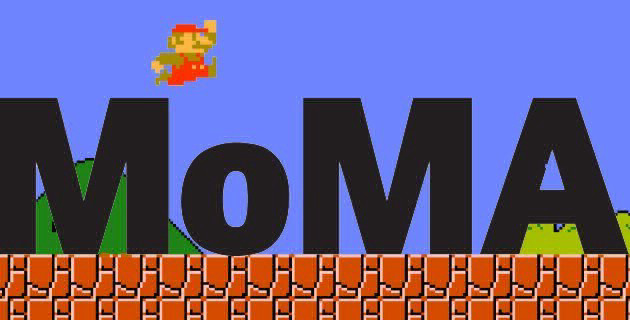
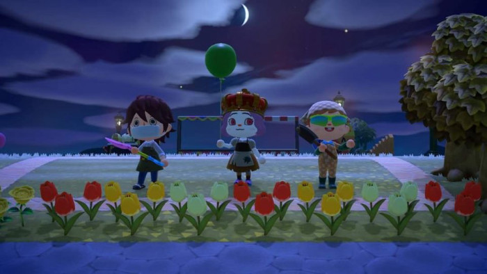
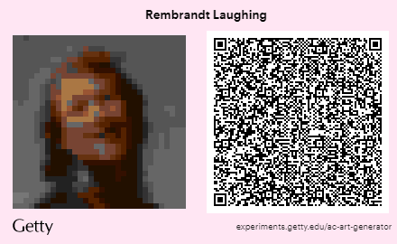

# 4.2. 동물의 숲에 등장한 모두의 박물관


  
인터넷의 등장 이후, 구술문화에서 기록 문화의 시대를 맞이하게 되면서 우리는 온라인을 통해 새로운 연대와 커뮤니케이션의 가능성을 가늠해볼 수 있게 되었다. 새로운 커뮤니케이션 환경과 디지털 영상 언어를 통한 패러다임의 대전환을 맞이하여, 오늘날 스크린 기반의 인식 사고 과정을 통한 온라인 공간에서의 탈신체화가 예술 실천으로 드러나는 과정을 동시대 디지털 문화 및 게임과 결부 시켜 생각해보고자 한다. 이는 포스트 휴먼적인 접근 방식을 탐구하는 일이자 ‘인간적인 것’에 대한 고찰을 담아내는 디지털 문화로의 본격적인 진입을 진단하는 계기를 마련할 것으로 기대된다. 2019년 코비드19로 인해 전 세계적으로 공장 가동 중단과 수출 제한에 따른 경제 위기는 우리의 일상과 삶의 방식을 변화시켰다. 사람들은 전염병의 확산을 막기 위해 자가격리 되었으며 컴퓨터와 와이파이를 통해 기존의 일상을 겨우 유지하게 되었다. 모든 문화 활동과 향유가 제한된 세상에서 우리들은 외부와 만나고 소통할 수 있는 대안을 찾기 시작했으며 SNS와 온라인 플랫폼, 그리고 게임은 유일하면서도 가장 안전하고 활발하게 소통할 수 있는 장소이자 공간으로 대체되었다. 사람들은 시간을 보내거나 유희를 위한 게임 외에도 닌텐도의 ‘모여봐요 동물의 숲\(Animal Crossing\)’같은 힐링 게임 혹은 커뮤니티 게임을 통해 현실과 동일한 시간이 흐르는 가상의 세계에서 위로받고 현실에서 할 수 없는 일들이 가능한 세계에 열광했다. 전염병으로 인한 여가 활동의 제한과 봉쇄령은 게임 산업의 성장과 매출 증가, 이용자 확대 및 게임 사용 시간의 폭발적인 증가로 이어졌으며, 이에 따라 매체로서 게임의 역할과 사회적 연대의 도구로서 게임이 재발견되는 순기능에 대한 재조명이 이루어졌다.

**미술관이 게임을 소장한다고?**  
뉴욕현대미술관\(Museum of Modern Art, MoMA, 이하 모마\)은 2010년 골뱅이표라 부르는 앳 사인 “@”을 소장한다. 이를 시작으로, 2012년과 2017년 두 차례에 걸쳐 ‘인터랙션 디자인’ 소장품 수집의 일환으로 게임을 소장하였고, 2016년에는 1999년 일본 NTT 도코모사에서 만든 이모지 176개를 소장한다. 당시 모마가 흔히 생각하는 미술관 소장품의 범주에서 벗어난 서브 컬쳐의 영역에 있었던 게임과 이모지 같은 디지털 소장품을 수집하게 된 결정에 대해, 과연 미술관이 게임이나 디지털 이미지의 저작권을 구입하는 것이 소장품의 범주에 들어갈 수 있는지, 어떠한 가치가 있는지, 있다면 어떤 형식으로 구매해야 하는지 등에 대한 첨예한 논의와 논란이 이어졌다. 그 중 특히나 게임의 소장에 관해서 모마의 건축 디자인 분과 수석 큐레이터였던 파올라 안토넬리의 결정과 설득은 미술관이 14점의 게임을 영구 소장하는 데 결정적인 역할을 했다. 그는 행동\(Behavior\), 미학\(Aesthetic\), 공간\(Space\), 시간\(Time\) 등 4가지 기준을 수립하고 이에 따라 소장할 게임의 리스트를 중장기 계획아래 선정하였다. 첫 번째로 소장한 게임으로는 팩맨\(Pac-Man, 1980\), 테트리스\(Tetris, 1984\), 심시티 2000\(SimCity 2000, 1994\), 플로우\(flOw, 2006\) 등이 포함되었고 2013년 &lt;어플라이드 디자인\(Applied Design\)&gt; 전시를 통해 선보였다. 전시의 성공에 힘입어 이후, 추가적으로 스페이스 인베이더\(Space Invaders, 1978\)와 마인크래프트\(Minecraft, 2011\) 등이 포함된 7개의 게임 소장품이 추가되었다.

**온라인으로 미술관 방문하기**   
모마의 경우 디자인 분과에서 주도적으로 인터랙션 디자인의 범주 안에서 게임 소장품을 미술관 안으로 들였다면, 테이트 미술관의 경우, 기존 게임의 활용적 측면에 주목하여, 디지털 시대의 잠재적 관객 개발과 소장품의 새로운 접근성 확장을 위해 게임을 활용한 프로젝트를 진행하였다. 2016년 테이트의 디지털 전략팀은 게임 개발자들과 ‘테이트 월드\(Tate World\)’ 플랫폼을 개발하여 마인크래프트 게임을 활용하여 테이트 미술관을 게임 내에 재현하였다. 마인크래프트는 스스로 지도를 만들고 플레이하는 자유도가 높은 게임으로, 개발자들과 함께 가상의 지도를 개발하고 홈페이지를 통해 무료로 다운로드 받을 수 있게 했던 전략팀의 방법은 평소에 마인크래프트를 즐겨하던 젊은 관객층과 해외 이용자들에게 호응을 얻었다. 당시 LTE 시대를 맞아 온라인에서 모바일로 넘어가는 과정에서 등장한 이러한 플랫폼의 확장이 여전히 물리적인 활동을 중심으로 부수적인 프로그램 혹은 이벤트 성격의 시범이었다면, 코비드19로 인해 모바일과 온라인은 물리적인 공간이 폐쇄되면서 대안이 아닌 유일한 공간으로 재편되었다. 이에 따라 루브르 박물관, 구겐하임, 내셔널 갤러리, 대영박물관, 메트로폴리탄 미술관 같은 전 세계 관람객들이 찾는 대형 박물관들은 온라인 투어와 프로그램을 개발하면서 버츄얼 관람 환경과 온라인 투어를 제공하였다. 그러나 익숙하지 않은 조작법으로 방문하지 않았던 공간을 둘러보는 것으로 실제 관람의 경험과 작품 감상을 대체하는 데에 한계가 드러났다. 핸드폰이나 디지털 기기를 통해 공간을 사유한다는 것, 언제나 개방되어 있다고 생각했던 공공기관들이 속수무책으로 한순간에 무기한 접근 불가능한 공간이 된다는 것, 전시를 보러 간다는 경험과 작품을 감상하는 행위를 포함한 문화 예술을 향유하는 일에 대해 다시금 생각해보게 됐다.\*  
\* 미팅룸, _셰어 미: 공유하는 미술, 반응하는 플랫폼_ 중 "2-1장 모두를 위한 모두에 의한 미술관", \(서울: 스위밍꿀, 2019\)

**모두의 박물관**  
특히나 문화 예술계 종사자로서 2019년과 2020년을 보내며 ‘미술관에 간다는 것’과 ‘전시를 감상한다는 것’ 뿐만 아니라 예술 창작 활동 전반에 대한 근본적인 질문들에 대해 고민하게 됐다. 그러면서 우리는 만나지 못했을 때 어떠한 방식으로 이전의 경험과 과정을 공유해야 하는 것인가, 그리고 이러한 것들이 여전히 유효한가를 생각해보게 됐다. 이러한 흐름은 줌이나 온라인, 채팅으로 소통하는 세상에서 완전히 새로운 커뮤니케이션 방식과 급변하는 공동체 감각은 게임 플랫폼을 활용한 새로운 연대와 경험에 의해 재편되었다. 특히나 닌텐도의 ‘동물의 숲’은 콘솔을 이용한 시뮬레이션 게임으로 동물들이 사는 섬에서 자신의 캐릭터를 움직이며 자유롭게 ‘슬로우 라이프’를 버츄얼 공간에서 즐기는 컨셉으로 거리두기 확산과 격리에 따른 게임 사용자의 폭발적인 급증으로 한 때 품귀 현상까지 일어나기도 했다. 기계가 없으면 접근성이 차단되는 콘솔 게임임에도 불구하고 다른 게임에 비해 ‘동물의 숲’이 이렇게까지 인기를 얻은 이유는, 1\) 자신의 섬을 꾸며서 전 세계 누구나 초대하고 방문할 수 있다는 점 2\) 섬의 컨셉과 주제에 따라 자유롭게 무궁무진한 세계관을 만들 수 있다는 점 3 \)의상 제작, 인테리어, 스토리텔링 구현도가 쉽고 정교하여 원하는 장면과 연출이 가능하다는 등 ‘힐링게임’이라는 시의 적절한 콘텐츠 외에도 타인과 교류하며 다양한 시뮬레이션을 통한 창작 활동이 가능하다는 점을 들 수 있다. ‘동물의 숲’의 모든 섬에는 동일한 박물관이 존재하며, 해당 박물관에는 자연사 박물관과 수족관 외에도 업데이트를 통해 미술 전시장 섹션이 추가되기 시작하면서 미국의 게티 미술관과 메트로폴리탄 미술관 등은 자신들의 소장품 이미지를 QR코드로 게임 내부에 오픈소스인 ‘마이 디자인’을 통해 무료 배포하고 누구나 소장품을 자신의 집과 섬에 자유롭게 전시할 수 있도록 제공했다. 그뿐만 아니라 시간과 공간의 제약 없이 누구나 게임기만 있으면 언제든지 만날 수 있으며, 섬 내에 등록된 디자인을 무료로 배포하고 공유할 수 있다는 점 때문에 글로벌 기업들은 게임 내에서 패션쇼를 진행하기도 하였으며, 전염병으로 인해 모일 수 없지만 온라인에서 만나 생일 파티를 하거나 집회의 수단으로 플랫폼을 활용하는 등 새로운 소통 방식과 움직임으로 발현되었다. 이러한 움직임에 힘입어 미팅룸은 코로나 바이러스로 인해 온라인의 새로운 활용과 미래의 공공기관에 대한 고민을 이어온 경기도 어린이 박물관과 함께 새로운 형태의 박물관을 게임 내에 구현해보고자 모두의 박물관\(Museum of Everyone, 이하 MoE\) 즉, MoE를 만들기에 이르렀다.

MoE는 미술관과 박물관을 구분하지 않는다. 뮤지엄\(museum\)이란 용어는 영문으로는 하나의 의미로 통하며 ‘어떠한’ 뮤지엄인가는 앞에 수식어로서 설명된다. 뮤지엄은 ‘뮤세이온\(museion\)’이라는 그리스 신화에 나오는 제우스의 신전을 의미하며 신화에 따르면 뮤세이온은 연구자뿐만 아니라 천문대, 해부실, 동물원과 식물원 그리고 책으로 이루어진 공간으로 기록되어 있다. 이러한 점에서 모이뮤지엄은 뮤지엄의 시작과도 맞닿아 있다고 볼 수 있다. 미술관과 박물관의 구분이나 관람객에 대한 정보, 국적, 시간, 편견이 없는 곳, 그래서 누구에게나 열려있고 관객을 대상화하거나 분류하지 않는 곳으로 만들고 싶었다. 특히나 동물의 숲이 최근에 추가한 기능으로 ‘꿈번지’를 통해 시간의 구애를 받지 않고 24시간 365일 개방된 모이뮤지엄의 방문이 가능해졌다. 코드를 통해 언제 어디서나 관람이 가능한 디지털 뮤지엄이자 편견이나 지정학적 위치에 의한 권력이나 권위가 없는 평등한 뮤지엄인 것이다. 인터넷망으로 연결된 것이 초연결이 아닌, 물리적으로도 우리는 타인과 닿아 있음을 우리는 전염병의 시대를 겪으며 알게 되었다. 전염병의 시대에 사람들과 교류가 차단된 우리는 부엌에서, 앞마당에서, 게임을 통해 가장 창의적인 활동을 통해 모두가 창작자가 되었다. 박물관이, 미술관이 사회의 신뢰를 받는 공공을 위한 공간으로 존재하기 위해 우리는 그 어느 때보다 더 치열하게 다시금 질문하고 답을 찾아야 할 것이다. 우리에게 박물관은 어떤 의미이고 우리는 이를 통해 무엇을 할 수 있는지 말이다. 앞으로 공개될 MoE가 어떠한 새로운 질문을 던져줄지 기대하게 되는 이유이다.

