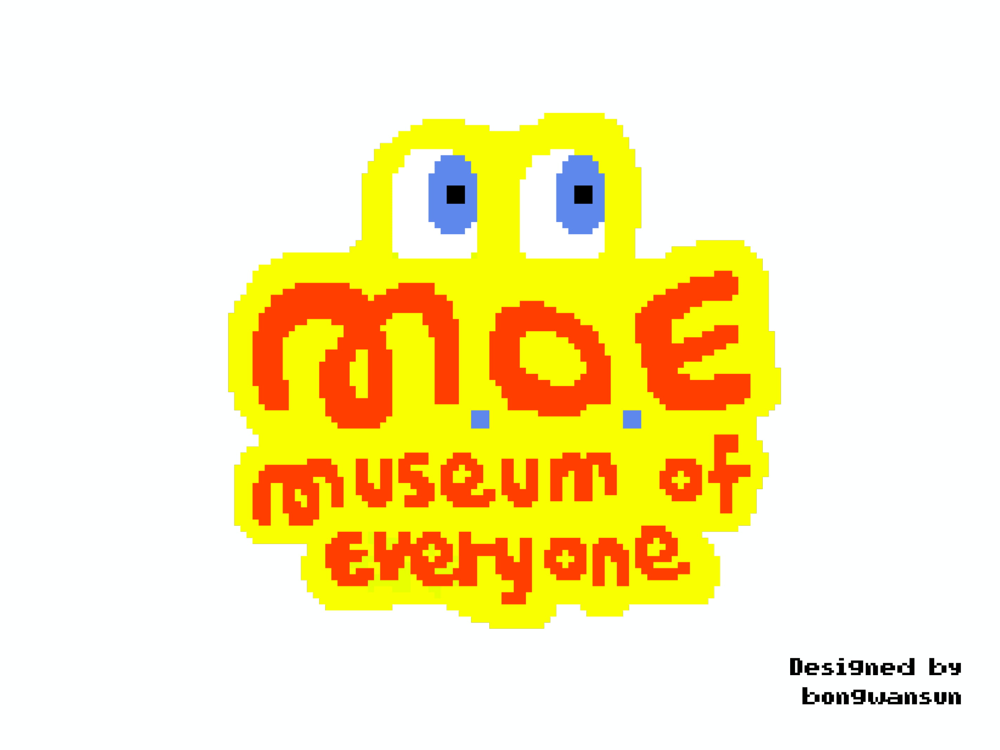
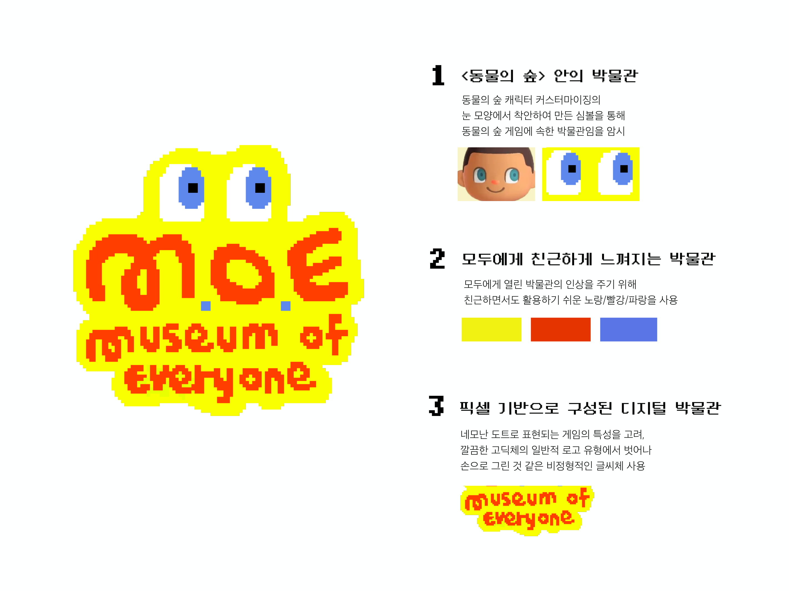
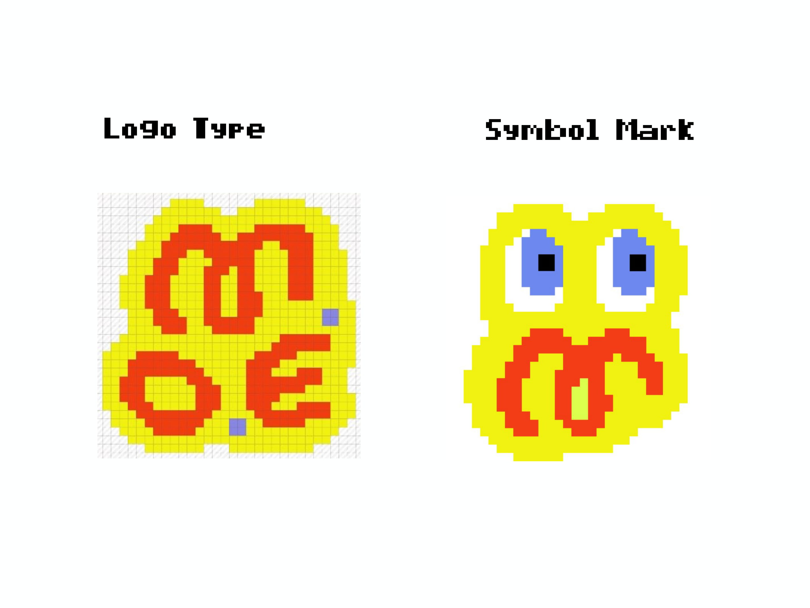
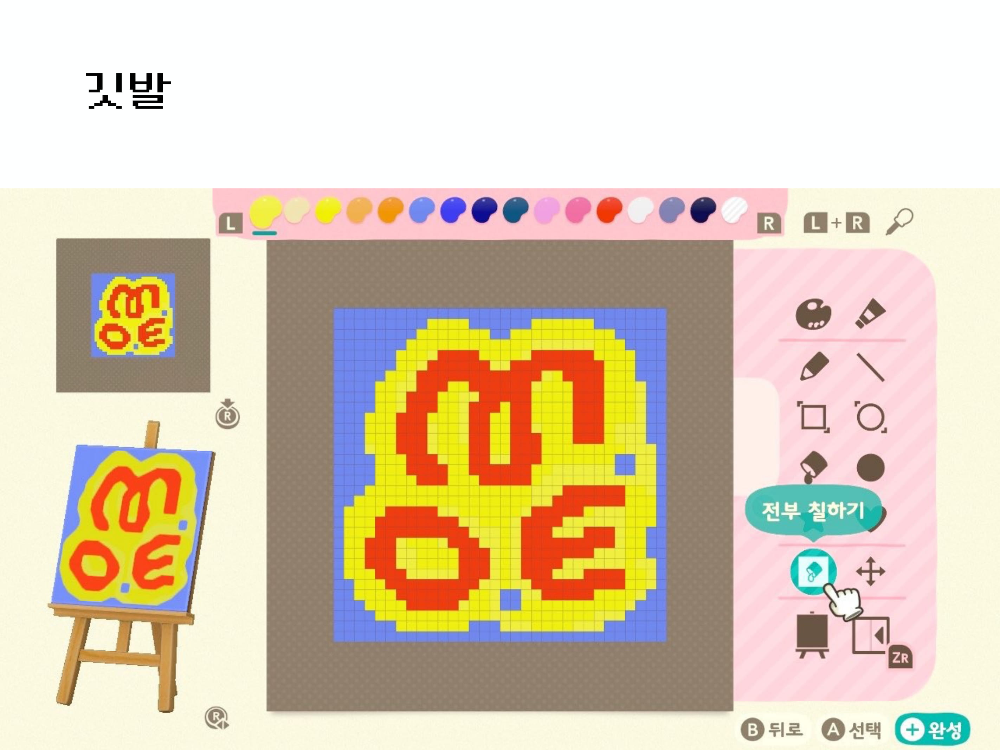
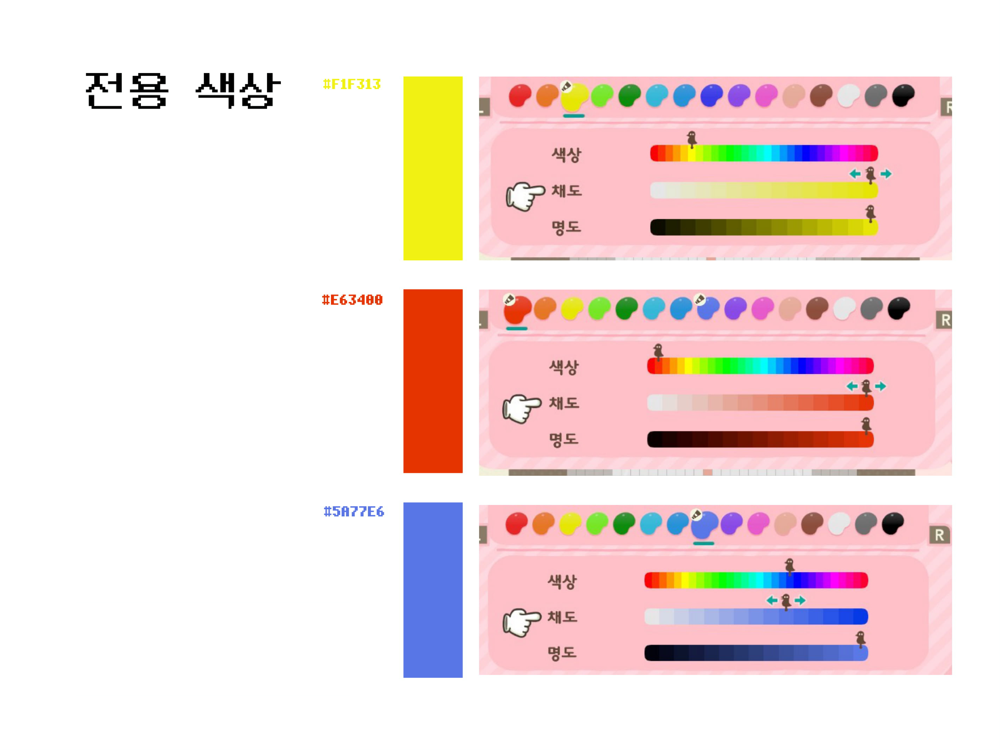
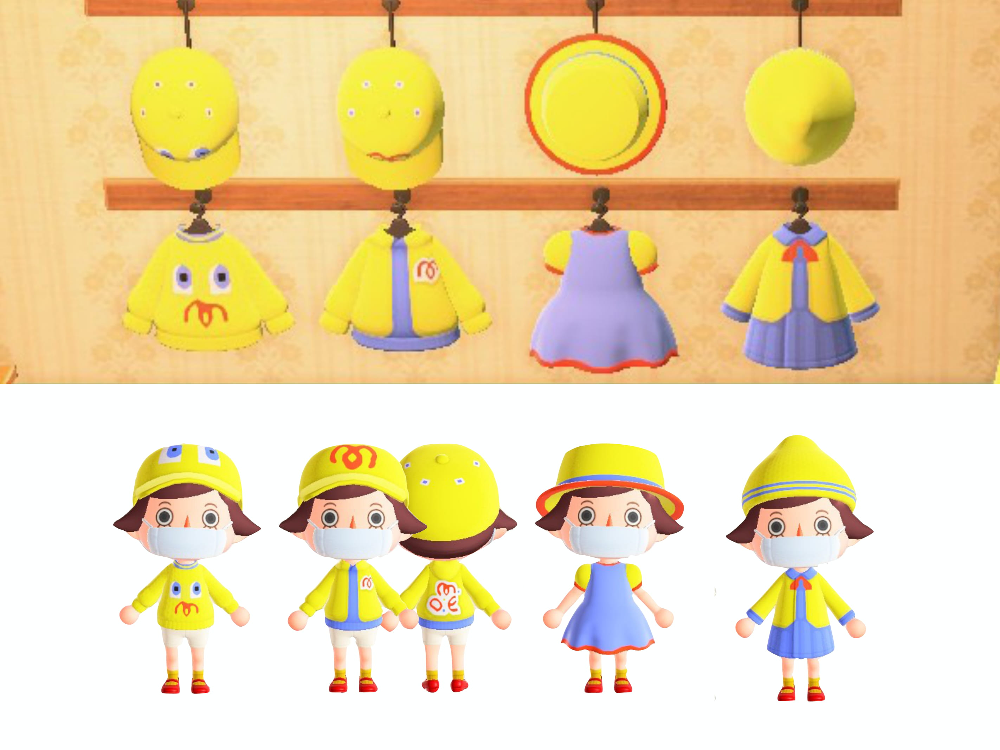

# 4.3. 모두의 박물관 MI

게임 내에 있는 ‘마이디자인’이라는 기능을 최대한 활용하여 MI를 개발하였다. 동물의 숲 내에는 1\)옷가게의 옷 디자인 2\)섬 내 에 있는 깃발 디자인 3\)여러 곳에 활용할 수 있는 기타 디자인을 마음대로 꾸밀 수 있다. 이에 봉완선 디자이너는 동물의 숲에 등장하는 캐릭터들의 얼굴, 특히 특징적인 눈을 활용하여 상징성을 더했다. 

* 비행기를 타고 섬으로 방문한다는 설정에 맞게 항공 뷰에서도 눈에 잘 띌 수 있도록 색감을 고려하였으며 옷 디자인, 동물의 숲에 꾸민 카페, 로고, SNS 계정 등 다양한 베리에이션을 진행하였다. 
* 해당 MI는 지속적으로 모이의 로고로 사용될 예정이며, 이벤트에 따라 색상을 변경하거나 다양한 방식으로 활용 계획을 갖고 있다. 
* 작가명과 작품명을 적는 캡션, 전시실 및 학예실, 관장실 등 사이니지 작업 등도 진행하였다.

 

