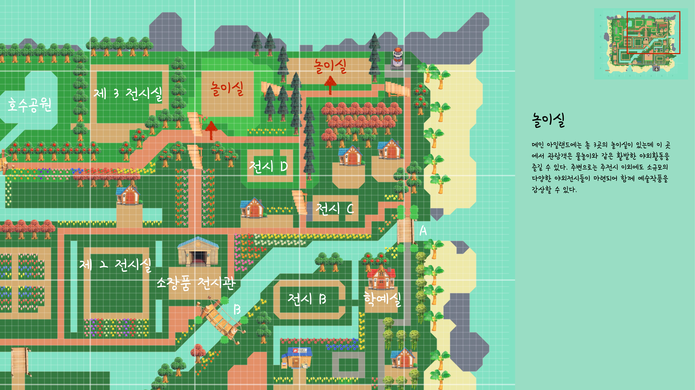

# 4.4. 모두의 박물관 로드맵 및 조경

경기도\(섬\)는 처음부터 야외 전시장 조성 및 주요 박물관 기능을 담기 위해 사전에 치밀하게 설계했다. 주요 기능인 전시장의 수와 규모를 고려 하였으며, 비행장에서 내려서 전체 섬을 하나의 전시장이자 박물관으로 인식하기 위한 동선을 고려하여 적절하게 배치하였다.   

* 비행장에서 내리자마자 길게 웰컴 스페이스를 고려하여 섬에 다다르면 코로나 시대의 발열 체크와 QR 찍기위한 책상을 세팅하였으며, 옷과 짐을 맡길 수 있는 장소를 마련하였다.
* 크게 메인 아릴랜드와 기존의 기능을 수행하는 주민들의 거주 지역 및 광장으로 구획하여 강을 건너가면서부터 본격적인 작품을 감상할 수 있도록 구분하였다.
* 기본적으로 전시장은 사방을 돌아서 정면으로 도달하게끔 강제동선으로 계획하였으며 카페 공간, 수유실, 놀이터 등을 구성하였다.

