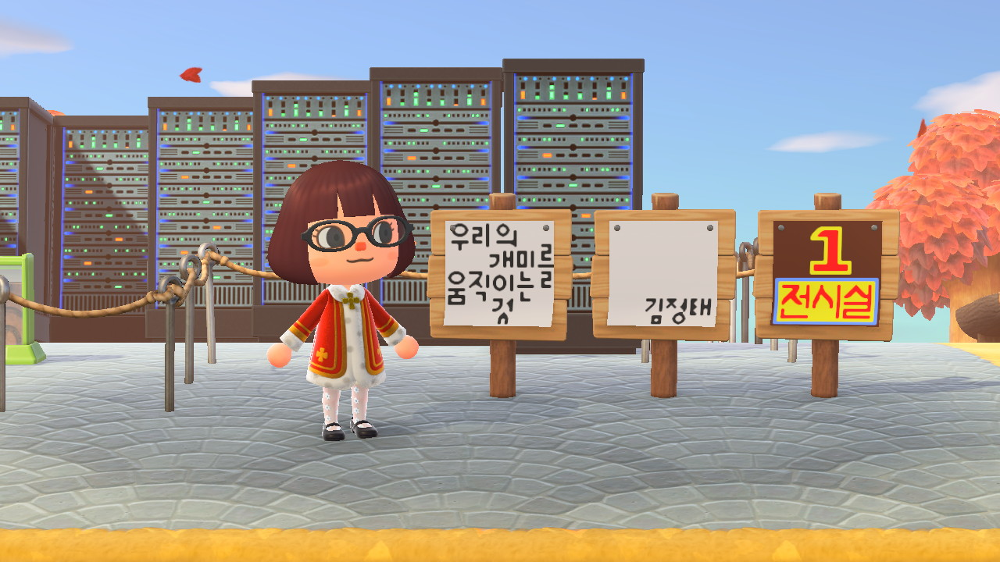
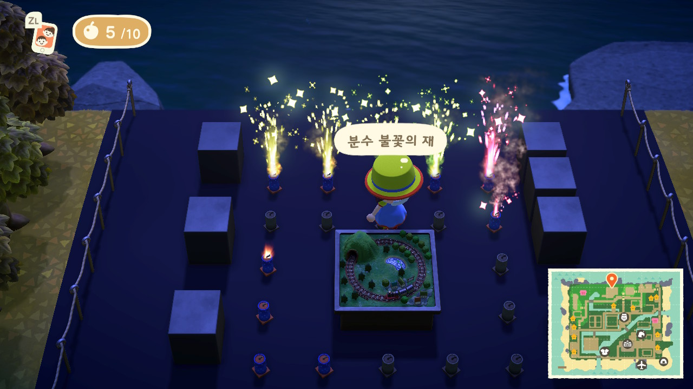
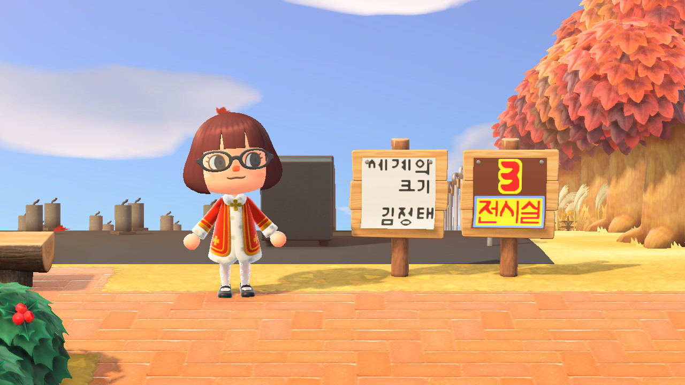
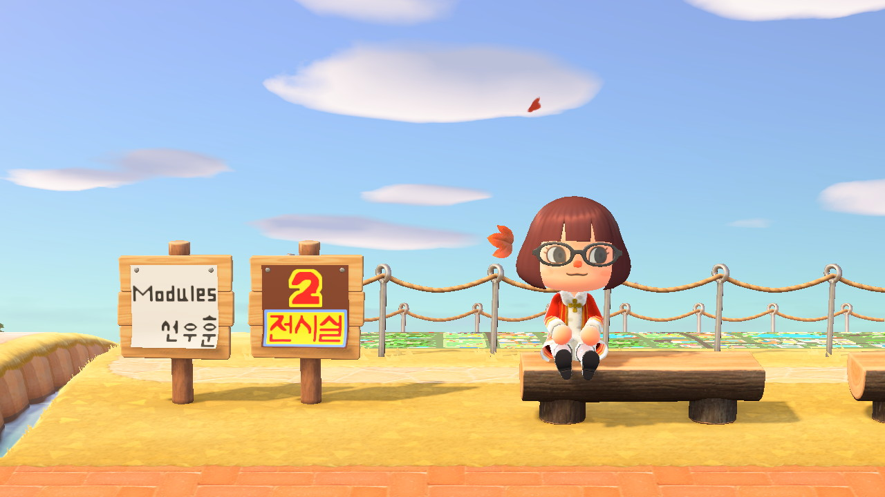

# 4.5. 개관 기념 설치 작품

* **우리의 개미를 움직이는 것\(김정태\)**  
       
  김정태는 &lt;동물의 숲&gt;의 게임 규칙과 활용도를 최대한 활용하여 ‘동물의 숲‘이라는 게임의 기능과 한계를 최대한 활용하는 방식을 취했다. 개인의 자유도와 활용도가 높은 것으로 유명한 ’동물의 숲‘의 장점을 최대한 활용하여 게임내에 존재하는 수만 가지의 디지털 오브젝트 중에서 밤과 낮에 다른 모습으로 보여질 수 있으며 공공미술의 영역으로 디지털 세계에 어울릴만한 오브젝트를 선정하여 구성하였다. 게임 내에 존재하는 예측 가능한 오브젝트를 새로운 의미를 부여하여 활용하고, 작가의 선택에 의해 배열하고 전시함으로써 개념 미술의 시작과 존재에 부합하는 새로운 의미 해석이 가능한 작품으로 재탄생시켰다. 특히나 데이터센터에 존재하는 서버와 개미집을 함께 구성하여 &lt;우리의 개미를 움직이는 것&gt;을 병치시킴으로써 보이지 않는 노동, 즉 게임 내에서도 ’슬로우 라이프’를 표방하지만 실제로 게임을 작동시키고 움직이는 것은 보이지 않는 노동과 인풋에 의해서 움직이는 것이라는 의미가 포함되어 있다.

 

* **세계의 크기\(김정태\)**  
       

  &lt;세계의 크기&gt;는 검은 바닥 위에 동일한 크기의 정사각형 구조물과 사용하고 남은 불꽃 26개로 구성된 공공미술 작품이다. 해프닝의 일환으로 아무도 볼 수 없는 불꽃은 작가만이 감상하고 이후 쓰고 남은 불꽃 놀이의 캔만 남게된 부재된 상황을 드러낸 작품이다. 디지털 전시에서 흔히 간과하거나 가늠할 수 없는 규모, 크기, 비례, 스케일감에 대해 플레이하는 실제 작가의 상상력이 어디까지 닿을 수 있을지 가늠해보는 작품이라고 할 수 있다. 동물의 숲에 등장하는 캐릭터들이 실제 인간의 신체를 왜곡하고 귀여움을 강조하기 위해 현실 세계의 비례와 비율을 따르지 않지만 게임을 하는 우리들은 위화감이나 어색함을 느끼지 않는다. 이러한 익숙함과 용인할 수 있는 정도, 경계에 대해서 ‘크기’라는 기준점을 통해 제시하였다.

  

* **modules\(선우훈\)**     선우훈 작가는 픽셀을 이용하여 웹툰을 그리는 작가이다. DAUM 플랫폼을 통해 선보인 &lt;데미지 오바 타임&gt;을 연재했으며 최근에는 &lt;나의 살던 고향은&gt; 이라는 연재를 진행하고 있다. &lt;modules&gt;은 픽셀 기반의 ‘동물의 숲’ 마이디자인을 가장 잘 활용할 수 있는 선우 훈 작가에게 바닥화를 의뢰하여 대지미술의 일환으로 ‘지도’라는 컨셉으로 제작한 작품이다. 마이디자인으로 섬에서 사용할 수 있는 슬롯은 총 50개이다. 선우훈 작가는 작품 디자인 안에 도로를 설정해둠으로써 누구나 퍼즐처럼 도시를 만들어보고 이어보고 변경할 수 있도록 DYI 형태의 조합형 작품을 제안하였다. 또한 해당 기계가 아닌 자신의 기계로 만든 21개의 조각 작품들을 만들고, 작게 혹은 크게 무한 증식할 수도 있는 가변크기의 대지미술을 제작함으로써 디지털에서만 가능한 형태의 흥미로운 디지털 페인팅이자 설치미술이자 대지미술을 제안했다.

