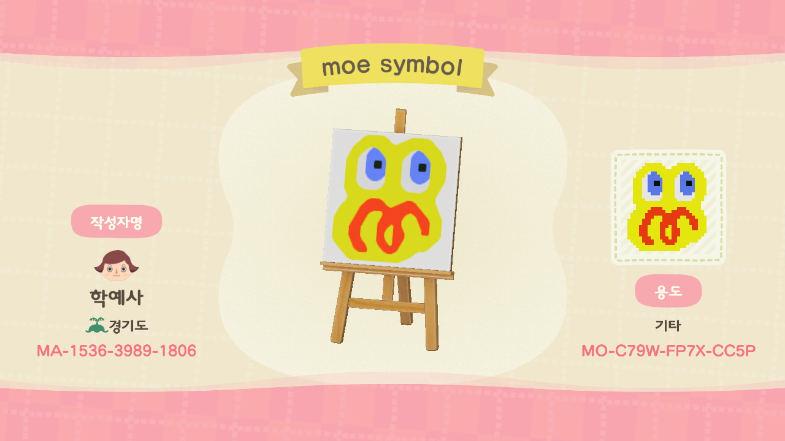
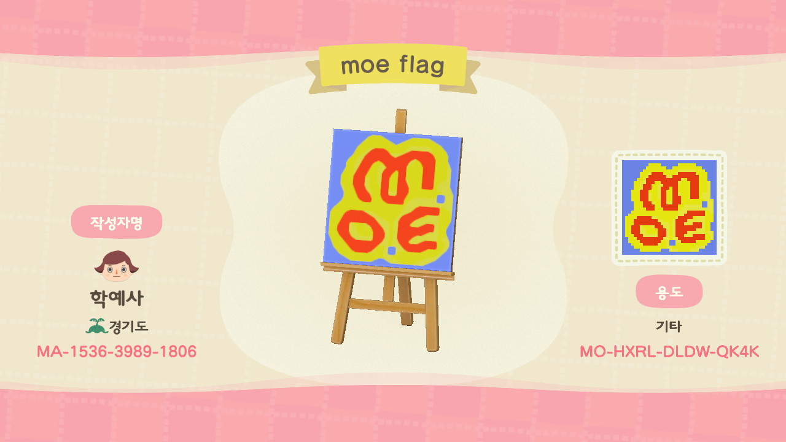
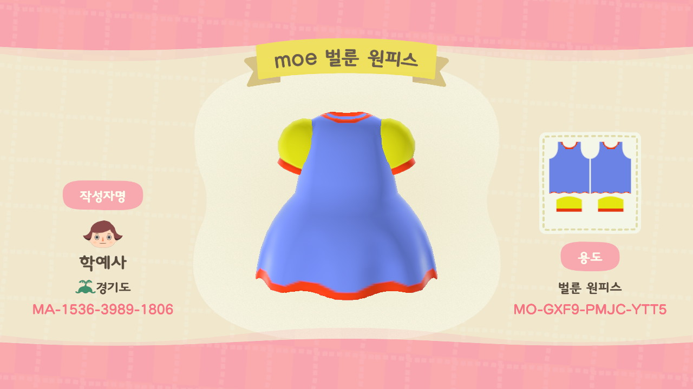
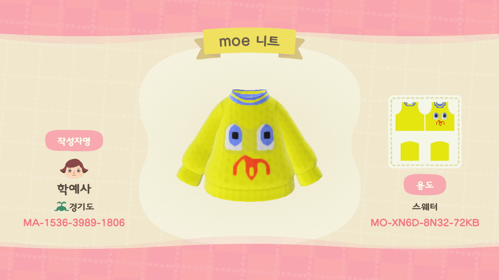
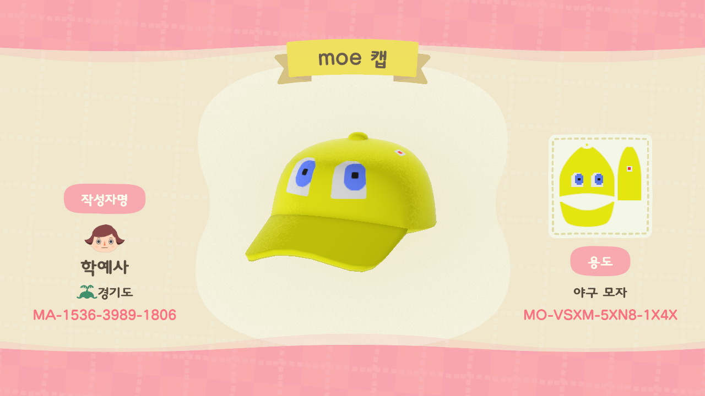
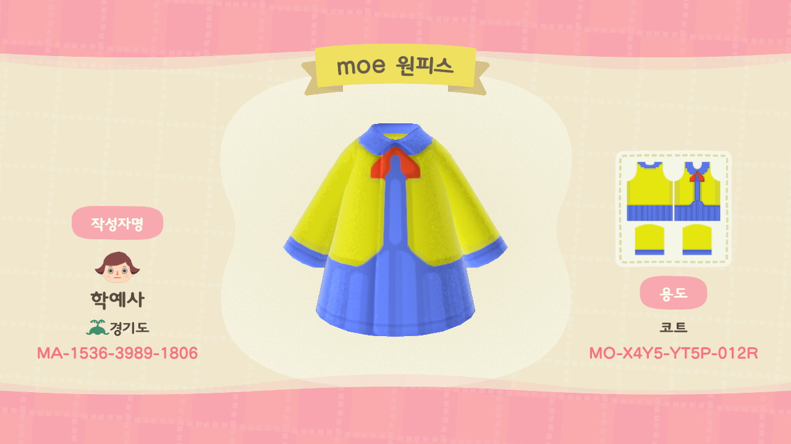
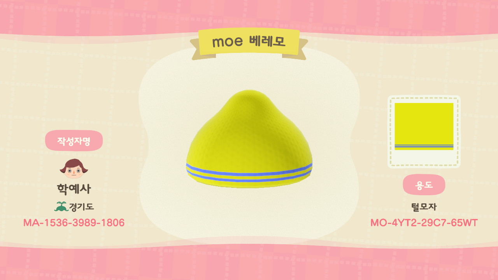

# 6.1.1. 모두의 박물관 MI

## 작가 ID

MA-1536-3989-1806

## 설명

모두의 박물관 MI는 로고 타입과 심볼 타입이 있다. 먼저 로고 타입은 네모난 도트로 표현되는 게임의 특성을 고려하여, 깔끔한 고딕체의 일반적인 로고 유형에서 벗어나 손으로 그린 것 같은 글씨체를 사용하였다. 심볼타입은 동물의 숲 캐릭터 커스터마이징의 '눈' 모양에서 착안하여 만들었으며 이를 통해 모두의 박물관이 동물의 숲과 관련이 있음을 암시하고자 했다. 한편 색상의 조합은 모두에게 친근하게 느껴지는 박물관의 인상을 주기 위해 가장 익숙하면서도 활용하기 쉬운 노랑\(\#F1F313\), 빨강\(\#63400\), 파랑\(\#5A77E6\)을 사용하였다. 모두의 박물관 MI를 활용한 작품으로는 깃발과 유니폼이 대표적이다.

## 목록

| image | identifier | title | Creator | Created | dateAccepted | dateCopyrighted | publisher | contributor | type | format | extent | isFormatof | rights |
| :--- | :--- | :--- | :--- | :--- | :--- | :--- | :--- | :--- | :--- | :--- | :--- | :--- | :--- |
|  | MO-C79W-FP7X-CC5P | moe 심볼 | 봉완선 | 2020-11-03 | 2020-11-03 | 2020-12-14 | 경기도어린이박물관 | 미팅룸 | interactive resource | application/octet-stream | - | ID codes | 공공누리의 제 4유형 |
|  | MO-RGL2-6NG5-L4K2 | moe 로고 | 봉완선 | 2020-11-03 | 2020-11-03 | 2020-12-14 | 경기도어린이박물관 | 미팅룸 | interactive resource | application/octet-stream | - | ID codes | 공공누리의 제 4유형 |
|  | MO-HXRL-DLDW-QK4K | moe 깃발 | 봉완선 | 2020-11-03 | 2020-11-03 | 2020-12-14 | 경기도어린이박물관 | 미팅룸 | interactive resource | application/octet-stream | - | ID codes | 공공누리의 제 4유형 |
|  | MO-GXF9-PMJC-YTT5 | moe 벌룬 원피스 | 봉완선 | 2020-11-03 | 2020-11-03 | 2020-12-14 | 경기도어린이박물관 | 미팅룸 | interactive resource | application/octet-stream | - | ID codes | 공공누리의 제 4유형 |
|  | MO-6X2P-3DK3-Q86S | moe 페도라 | 봉완선 | 2020-11-03 | 2020-11-03 | 2020-12-14 | 경기도어린이박물관 | 미팅룸 | interactive resource | application/octet-stream | - | ID codes | 공공누리의 제 4유형 |
|  | MO-XN6D-8N32-72KB | moe 니트 | 봉완선 | 2020-11-03 | 2020-11-03 | 2020-12-14 | 경기도어린이박물관 | 미팅룸 | interactive resource | application/octet-stream | - | ID codes | 공공누리의 제 4유형 |
|  | MO-VSXM-5XN8-1X4X | moe 캡 | 봉완선 | 2020-11-03 | 2020-11-03 | 2020-12-14 | 경기도어린이박물관 | 미팅룸 | interactive resource | application/octet-stream | - | ID codes | 공공누리의 제 4유형 |
|  | MO-T82L-XWK1-FM9Y | moe 야구잠바 | 봉완선 | 2020-11-03 | 2020-11-03 | 2020-12-14 | 경기도어린이박물관 | 미팅룸 | interactive resource | application/octet-stream | - | ID codes | 공공누리의 제 4유형 |
|  | MO-YGQB-GY8D-5C52 | moe 캡 | 봉완선 | 2020-11-03 | 2020-11-03 | 2020-12-14 | 경기도어린이박물관 | 미팅룸 | interactive resource | application/octet-stream | - | ID codes | 공공누리의 제 4유형 |
|  | MO-X4Y5-YT5P-012R | moe 원피스 | 봉완선 | 2020-11-03 | 2020-11-03 | 2020-12-14 | 경기도어린이박물관 | 미팅룸 | interactive resource | application/octet-stream | - | ID codes | 공공누리의 제 4유형 |
|  | MO-4YT2-29C7-65WT | moe 베레모 | 봉완선 | 2020-11-03 | 2020-11-03 | 2020-12-14 | 경기도어린이박물관 | 미팅룸 | interactive resource | application/octet-stream | - | ID codes | 공공누리의 제 4유형 |

