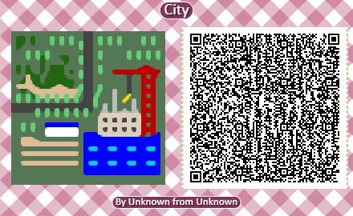
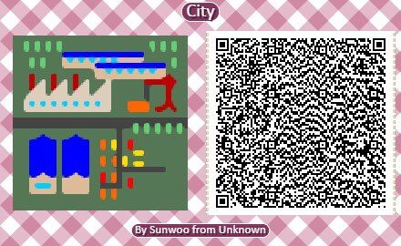
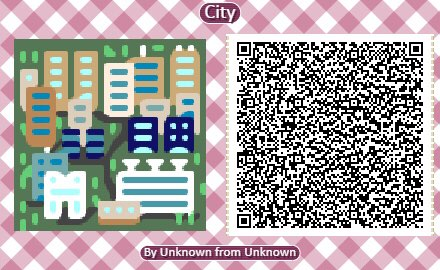
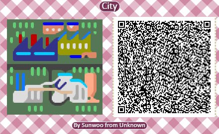
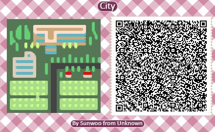
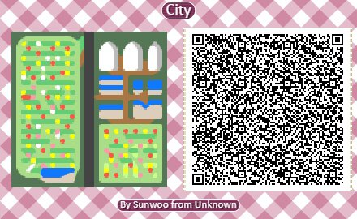
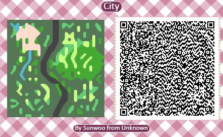
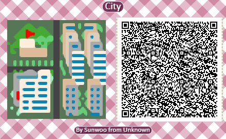
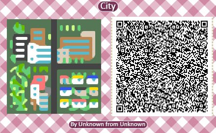

# 6.1.2. modules

## 저장소 

[https://github.com/gcmuseum/museumofeveryone/tree/sunwoohoon](https://github.com/gcmuseum/museumofeveryone/tree/sunwoohoon)

## 설명 

선우훈의 &lt;modules&gt;는 도시 풍경이 담긴 총 21개의 모듈로 구성되어 있다. 동물의 숲 내에서 설치가 가능한 가변 크기의 대지미술 작품이며,  누구든지 모듈을 자유롭게 조합하여 다양한 도시의 지도를 만들어볼 수 있다. 

## 목록 

| images | identifier | title | Creator | Created | dateAccepted | dateCopyrighted | publisher | contributor | type | format | extent | isFormatof | rights |
| :--- | :--- | :--- | :--- | :--- | :--- | :--- | :--- | :--- | :--- | :--- | :--- | :--- | :--- |
|   | 9dc3bdbaf91d23424feb087bc5d2984e | modules 001 | 선우훈 | 2020-10-25 | 2020-11-02 | 2020-12-14 | 경기도어린이박물관 | 미팅룸 | interactive resource | application/octet-stream | 620 byte | QR codes | 공공누리의 제 4유형 |
|   | 26ded0f03046be96b1c02eb12d0f96e9 | modules 002 | 선우훈 | 2020-10-25 | 2020-11-02 | 2020-12-14 | 경기도어린이박물관 | 미팅룸 | interactive resource | application/octet-stream | 620 byte | QR codes | 공공누리의 제 4유형 |
|   | 86ebf00ea682de5486d678cf2514ffb5 | modules 003 | 선우훈 | 2020-10-25 | 2020-11-02 | 2020-12-14 | 경기도어린이박물관 | 미팅룸 | interactive resource | application/octet-stream | 620 byte | QR codes | 공공누리의 제 4유형 |
|   | 98f4545f8c45537d3e237662a378e392 | modules 004 | 선우훈 | 2020-10-25 | 2020-11-02 | 2020-12-14 | 경기도어린이박물관 | 미팅룸 | interactive resource | application/octet-stream | 620 byte | QR codes | 공공누리의 제 4유형 |
|   | 326ac2a9a22a17226aaf3c3952c996d9 | modules 005 | 선우훈 | 2020-10-25 | 2020-11-02 | 2020-12-14 | 경기도어린이박물관 | 미팅룸 | interactive resource | application/octet-stream | 620 byte | QR codes | 공공누리의 제 4유형 |
|   | 339f91ee57067b4230b4b9e757d4873f | modules 006 | 선우훈 | 2020-10-25 | 2020-11-02 | 2020-12-14 | 경기도어린이박물관 | 미팅룸 | interactive resource | application/octet-stream | 620 byte | QR codes | 공공누리의 제 4유형 |
|   | 463e6faa429a5dd4ca7a47c40b560deb | modules 007 | 선우훈 | 2020-10-25 | 2020-11-02 | 2020-12-14 | 경기도어린이박물관 | 미팅룸 | interactive resource | application/octet-stream | 620 byte | QR codes | 공공누리의 제 4유형 |
|   | 940b18d3be18ed6f0bb8516a150d0082 | modules 008 | 선우훈 | 2020-10-25 | 2020-11-02 | 2020-12-14 | 경기도어린이박물관 | 미팅룸 | interactive resource | application/octet-stream | 620 byte | QR codes | 공공누리의 제 4유형 |
|   | 2383c03fa0f6a05dd2f294e97cc8c1ca | modules 009 | 선우훈 | 2020-10-25 | 2020-11-02 | 2020-12-14 | 경기도어린이박물관 | 미팅룸 | interactive resource | application/octet-stream | 620 byte | QR codes | 공공누리의 제 4유형 |
|   | 808018d754f8b0adec4e2e62962d8f6b | modules 010 | 선우훈 | 2020-10-25 | 2020-11-02 | 2020-12-14 | 경기도어린이박물관 | 미팅룸 | interactive resource | application/octet-stream | 620 byte | QR codes | 공공누리의 제 4유형 |
|   | 36632758da1adf3f26924e18661cece7 | modules 011 | 선우훈 | 2020-10-25 | 2020-11-02 | 2020-12-14 | 경기도어린이박물관 | 미팅룸 | interactive resource | application/octet-stream | 620 byte | QR codes | 공공누리의 제 4유형 |
|   | 558318537fc3657f6385012655801c0c | modules 012 | 선우훈 | 2020-10-25 | 2020-11-02 | 2020-12-14 | 경기도어린이박물관 | 미팅룸 | interactive resource | application/octet-stream | 620 byte | QR codes | 공공누리의 제 4유형 |
|   | ae3c003f85cb8dd62759bac4f1550386 | modules 013 | 선우훈 | 2020-10-25 | 2020-11-02 | 2020-12-14 | 경기도어린이박물관 | 미팅룸 | interactive resource | application/octet-stream | 620 byte | QR codes | 공공누리의 제 4유형 |
|   | b3670b1706fb9c61c48c510940b6718b | modules 014 | 선우훈 | 2020-10-25 | 2020-11-02 | 2020-12-14 | 경기도어린이박물관 | 미팅룸 | interactive resource | application/octet-stream | 620 byte | QR codes | 공공누리의 제 4유형 |
|   | ba3c0b66b93f09f6da359d5fd80a6ec0 | modules 015 | 선우훈 | 2020-10-25 | 2020-11-02 | 2020-12-14 | 경기도어린이박물관 | 미팅룸 | interactive resource | application/octet-stream | 620 byte | QR codes | 공공누리의 제 4유형 |
|   | bc60b88e5509a84829d8f1791832edb4 | modules 016 | 선우훈 | 2020-10-25 | 2020-11-02 | 2020-12-14 | 경기도어린이박물관 | 미팅룸 | interactive resource | application/octet-stream | 620 byte | QR codes | 공공누리의 제 4유형 |
|   | c850a87b1414c7e42cf6390e9fd82c91 | modules 017 | 선우훈 | 2020-10-25 | 2020-11-02 | 2020-12-14 | 경기도어린이박물관 | 미팅룸 | interactive resource | application/octet-stream | 620 byte | QR codes | 공공누리의 제 4유형 |
|   | dc2c9142c6262be013835f6048476cd2 | modules 018 | 선우훈 | 2020-10-25 | 2020-11-02 | 2020-12-14 | 경기도어린이박물관 | 미팅룸 | interactive resource | application/octet-stream | 620 byte | QR codes | 공공누리의 제 4유형 |
|   | de88557eb4b9727f953ebbabd9cfcdaf | modules 019 | 선우훈 | 2020-10-25 | 2020-11-02 | 2020-12-14 | 경기도어린이박물관 | 미팅룸 | interactive resource | application/octet-stream | 620 byte | QR codes | 공공누리의 제 4유형 |
|   | e788082700618688a6fbc3521a64f563 | modules 020 | 선우훈 | 2020-10-25 | 2020-11-02 | 2020-12-14 | 경기도어린이박물관 | 미팅룸 | interactive resource | application/octet-stream | 620 byte | QR codes | 공공누리의 제 4유형 |
|   | fa307a737b1a58d749a5c887c68f0d39 | modules 021 | 선우훈 | 2020-10-25 | 2020-11-02 | 2020-12-14 | 경기도어린이박물관 | 미팅룸 | interactive resource | application/octet-stream | 620 byte | QR codes | 공공누리의 제 4유형 |

