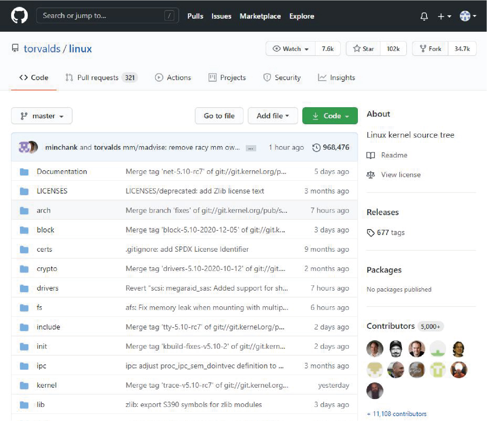
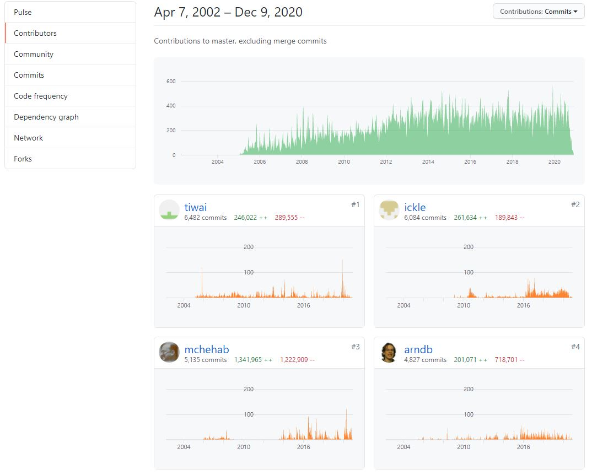
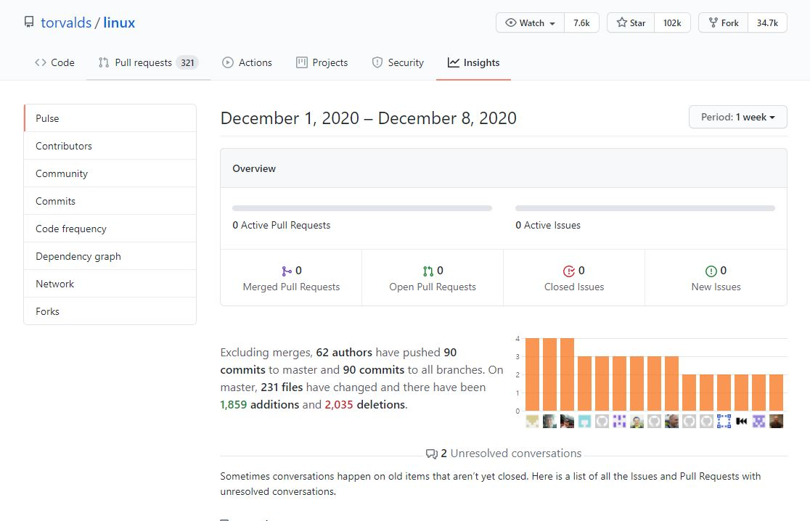
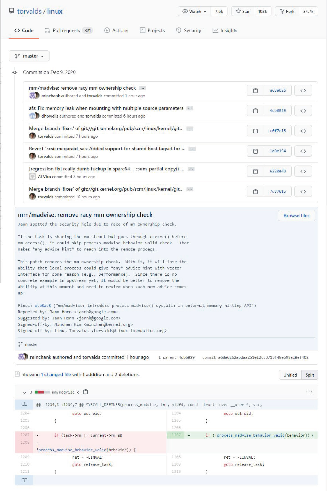
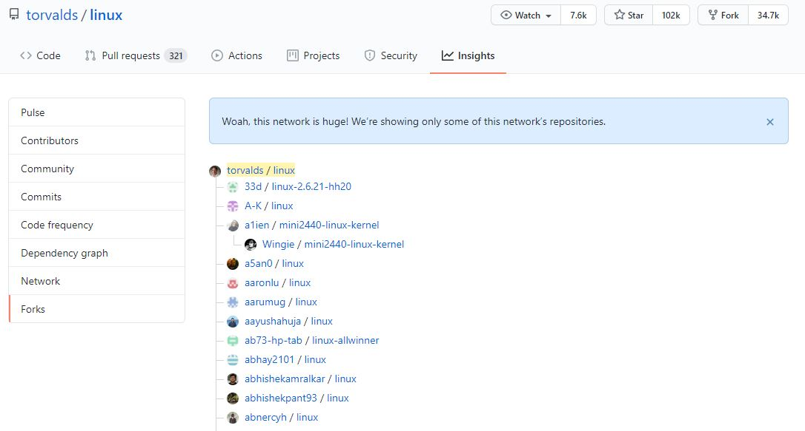
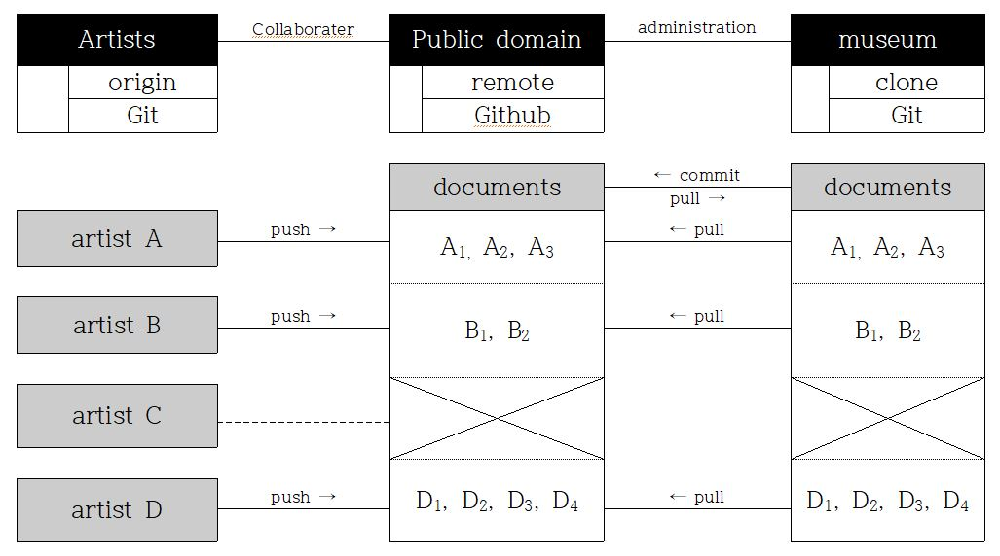

# 7.1.1. Git과 Github, 그리고 Linux

[정보통신산업진흥원의 한 연구 보고서](https://webcache.googleusercontent.com/search?q=cache:Vt9N-KcKfBAJ:https://www.nipa.kr/main/downloadBbsFile.do%3Fkey%3D116%26bbsNo%3D11%26atchmnflNo%3D8793+&cd=1&hl=ko&ct=clnk&gl=kr)에 따르면, 2019년을 기준으로 미국 기업 중 78%는 오픈소스 소프트웨어를 기반으로 운영하고 있으며, 미국 기업에서 일반적으로 사용하는 1,000개의 응응 프로그램 중 오픈소스 구성 요소가 무려 96%를 차지하는 것으로 나타났다. 이와 같은 오픈소스의 사용은 지금과 같은 디지털 시대에 세분화된 분업을 통해 소프트웨어를 생산하는 보편적인 노동 방식으로부터 기안한 것이라고 볼 수 있는데, 그 대표적인 사례가 바로 Git과 Github이다. 

&lt;그림 1&gt;은 리누스 토발즈가 Github 내의 자신의 저장소\(repository\)를 통해 공개한 리눅스\(linux\)의 소스파일이며, 누구든지 그 변경 이력에서부터 변경 내용을 추적하는 것뿐만 아니라 개발에 기여한 사람과 여러 개발자 간의 작업을 조율하는 과정에 이르기까지, 즉 리눅스 개발과 관련한 모든 정보의 확인이 가능하다. 이에 대해 추가 설명을 덧붙이자면,

* 지난 2002년 4월 7일부터 2020년 11월 9일까지 리눅스는 총 968,476번의 변경 이력이 있으며, 이에 기여한 사람의 수는 약 11,108명이고 이들 각자의 작업 내용은 모두 확인 가능하다. 

* 한편 지난 1주일 동안은 총 62명의 개발자가 90회에 걸쳐서 231개의 파일을 변경했으며, 변경 과정에서 파일의 소스코드에는 1,859회의 추가와 2,035회의 삭제 작업이 있었다. 

* 그 변경 이력은 모두 추적 가능할 뿐만 아니라 변경 전후 버전 비교를 통해 변경 내용을 확인할 수 있으며, 변경 이전의 상태로 돌아갈 수도 있다.

* 끝으로 ‘Fork’라는 버튼을 클릭할 경우 해당 저장소의 모든 파일을 자신의 저장소로 복사할 수 있다. Github의 이용자 중 약 34만 7천 명이 리눅스를 복사하였으며, 이 또한 모두 기록으로 남아 그 추적이 가능하다.   

따라 본 연구에서는 도입하고자 하는 분산형 버전관리 시스템의 활용 방안은 &lt;그림 6&gt;과 같다. 여기서 저장소는 ‘origin’과 ‘remote’ 두 가지가 있는데, 전자는 실제로 작품이 저장된 위치를 말하며 Git이 설치된 저장 장치를 뜻한다. 쉽게 이해하자면 PC에서 Git을 통해 관리하는 디렉터리\(directory\)가 이에 해당하며 외부로부터의 접근을 통제할 수 있다. 후자는 github 내의 원격 저장소를 의미하며, 누구든지 url을 통해 접근이 가능하다. 한편, 원격 저장소의 관리자\(administrator\)는 이를 자신의 저장 장치로 복제\(clone\)하고 이를 Git으로 통제할 수 있다. 원격 저장소의 관리자는 그 권한을 다른 사람에게 부여할 수 있는데, 일반적으로 권한을 부여받은 사람을 협업자\(collaborator\)라고 부른다.  

1. **작가\(Artists\)**
   * 최초의 작품은 작가의 저장소\(Git\)에 저장되며, 이를 통해 작가는 작품에 대한 소유와 배타적 권리를 보장받을 수 있다.
   * 이후 작가는 선택에 따라 작품을 박물관의 원격 저장소\(Github\)로 전송\(push\)할 수 있으며, 이때 ‘공유’의사와 더불어 작품에 대한 간략한 소개를 메시지\(commit\)로 남길 수 있다.
   * 이때 작가는 박물관에 ‘협업자’ 권한을 부여할 수 있는데, 이 경우 박물관은 작가 B의 경우와 같이 언제든지 작가의 작품을 박물관의 원격 저장소로 불러들일 수 있다.
   * 작품 공유의 의사가 없는 작가 C의 경우는 위 관계도에서 아무런 활동이 이루어지지 않는다. 
2. **퍼블릭 도메인\(Public Domain\)**
   * 작품의 공유를 위해 운영하는 원격 저장소\(Github\)이며, 이에 대한 관리 책임은 박물관의 담당자에게 있다
   * 원격 저장소는 여러 브랜치\(branch\)로 나누어져 있는데, 모형에서는 짙은 회색 배경의 칸이 ’master’ 브랜치에 해당하며, 이에 대한 변경 권한은 원격 저장소의 관리자에게 있으며 저장소에 변동 사항이 생길 때 마다 이를 ‘readme.md’파일에 기록한다.
   * master 이외의 브랜치는 반드시 작가가 자신의 작품을 원격 저장소로 전송할 때만 만들어진다.
   * Public Domain에서 있는 모든 작품\(공공누리 제4유형의 공공저작물\)은 누구나 이용가능하며, 작품은 QR 코드를 통해 배포한다.
3. **박물관\(museum\)**
   * 박물관의 저장소를 뜻하며, 이는 퍼블릭 도메인을 복제한 저장소\(origin repository\)를 뜻한다. 
   * 별도로 박물관에서 작품을 보관하는 이유는 작품의 유통 과정에서 위변조 등의 훼손으로 인해 분쟁이 일어났을 때를 대비하기 위해서이다.

 

