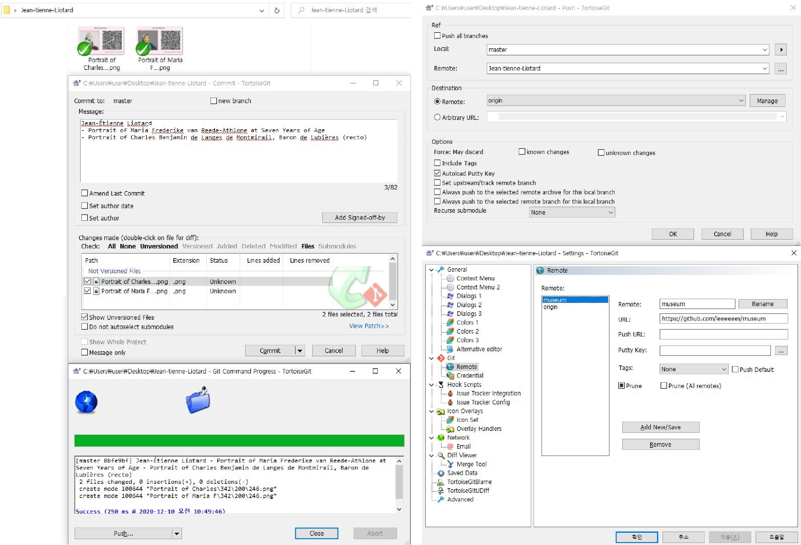
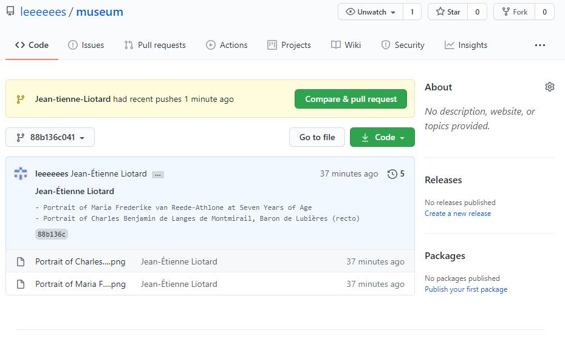
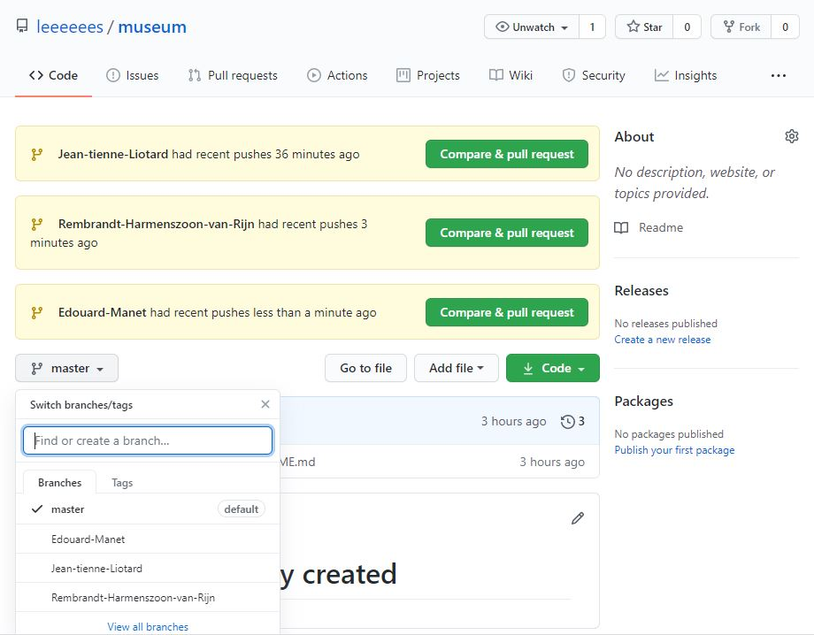
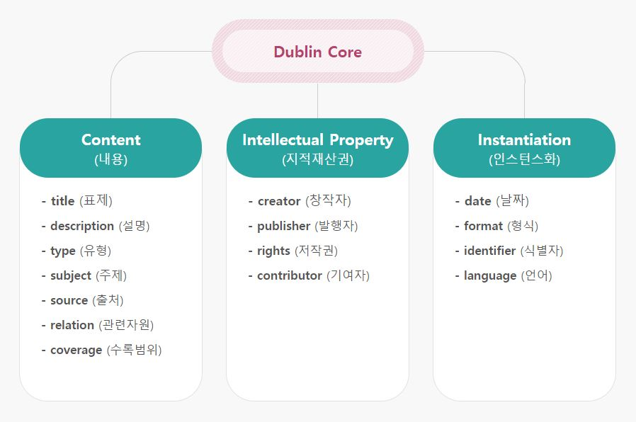
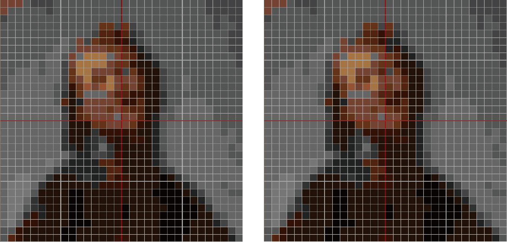
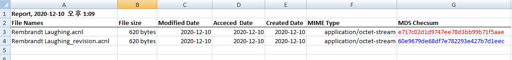
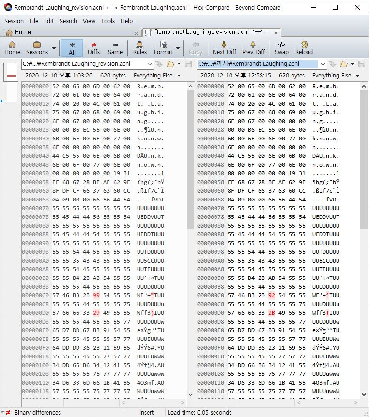

# 7.1.2. 분산형 버전관리 시스템을 활용한 기록관리

이상의 사례 연구를 토대로 본 여구에서는 다음과 같은 실제 사례를 진행해 보았다. Git에 익숙하지 않은 사람을 위해 설명 자료는 ‘Tortoisegit’라는 Git 클라이언트로 사용하여 만들었으며, 예시로는 게티 리서치 인스티튜트\(Getty Research Institute\)의 ‘Animal Crossing Art Generator’를 통해 리오타드\(Jean tienne Liotard\), 렘브란트\(Rembrandt Harmenszoon van Rijn\), 마네\(Édouard Manet\)의 작품을 사용하였다. 다음 &lt;그림 7&gt;은 리오타르의 저장소 작품이 디렉터리에 저장된 이후, 이를 원격 저장소로 푸시하는 과정을 설명한 것이다.

1. 리오타르의 폴더 안에 작품 배포를 위한 파일을 저장한 뒤에 이를 반영하기 위해 ‘commit’을 한다.
2. 이후 작품 배포를 위해 원격 저장소로 파일을 ‘push’를 한다. 이때 원격 저장소\(remote\)의 명칭은 작가명\(Jean-tienne-Liotard\)으로 하며, 그 주소는 원격 저장소의 url\([https://github.com/leeeeees/museum\)을](https://github.com/leeeeees/museum%29을) 사용한다.
3. 앞서 소개한 과정의 결과는 Github의 원격 저장소에서 &lt;그림 8&gt;과 같이 확인할 수 있다.

현재 원격 저장소의 브랜치는 &lt;그림 9&gt;와 같이 ‘master’, ‘Jean-tienne-Liotard’, ‘Rembrandt-Harmenszoon-van-Rijn’, ‘Edouard-Manet’로 구성되어 있으며, 저장소의 각 브랜치에 작품이 입수될 때마다 관리자는 작품에 대한 목록을 작성한다. 이때 목록의 메타데이터 세트는&lt;그림 10&gt;과 같 DCMI\(Dublin Core Metadata Initiatives\)의 사용을 권장한다.

한편 원격 저장소와 연결된 박물관의 저장소에서는 작품의 배포를 위한 QR 코드 파일 외에 실제 작품을 디지털 오브젝트\(.acnl\)의 형태로 저장하고 있는데, 이는 작품의 소장이나 보존을 위해서가 아니라 앞서 언급한대로 작품의 유통 과정에서 위변조 등의 훼손으로 인해 분쟁이 일어났을 때를 대비한 것이다. 다음 &lt;그림 11&gt;에서 좌측 이미지는 Animal Crossing Art Generator를 통해 얻은 &lt;렘브란트의 웃음&gt;이고 우측은 그 이미지의 도트 픽셀 하나를 바꾼 것인데, 육안으로는 그 차이를 거의 식별할 수가 없다.

하지만, 이는 두 파일은 각각의 해시 함수\( hash function\)나 16진수 값\(Hex code\)을 비교해봄으로써 그 차이를 명확한 알아낼 수 있다. 하나의 데이터는 반드시 하나의 해시 함만 만들어낼 수 있기 때문에 &lt;그림 12&gt;에서 볼 수 있듯이 작품의 모든 정보와 기록을 변조하더라도 해시 함수의 위조는 원천적으로 불가능하다.  

또한, ‘무엇’을 얼마만큼 위조하였는지 이를 구체적으로 증명할 필요가 있을 때는 작품 파일을 16진수 값으로 변환하여 이를 비교해 보는 방법을 취할 수 있다. &lt;그림 13&gt;에서 좌측의 16진수는 위조 파일의 값이며 우측은 진본 파일의 값인데 모든 값을 일일이 대조하여 그 차이점을 구체적으로 밝혀낼 수 있다. 현재 &lt;그림 13&gt;에서 진본과 위조의 차이가 확인 부분은 빨간색으로 표기된 값이다.  

이상의 연구는 프로비넌스의 무결성 입증을 위해 'Git과 Github를 활용한 기록관리 모델'에 따라 실제로 그 시스템을 구축해본 것이다. 본 실험의 결과에서는 승인된 권한에 따라 변경 사항을 통제할 수 있을 뿐만 아니라 어떠 경우에도 그 변경 이력을 모두 추적 가능하다는 점에서 프로비넌스의 무결성을 유지하기 위한 요구조건을 대부분 충족시키고 있다고 볼 수 있다. 뿐만 아니라 이 모든 과정은 시스템의 관리자 뿐만 아니라 누구든지 조회할 수 있으며 원격 저장소 그 자체를 복제하여 자신의 것으로 소유할 수도 있다.   
비록 본 실험에서 제시하고 있는 방안은 작품의 위변조나 훼손을 원천적으로 방지할 수 없는 한계는 있지만, 향후 분쟁 시 그 진위여부를 밝혀낼 수 있는 충분한 방안을 제시하고 있다. 한편 Git과 Github의 사용 방법을 모를 경우 이러한 공유 방식은 이용자에게 큰 불편을 초래할 수 있지만, 본 연구에서는 작가의 권리를 존중하고 배려하는 것이 이용자의 편의보다는 좀더 중요한 사안이라고 생각했다.

